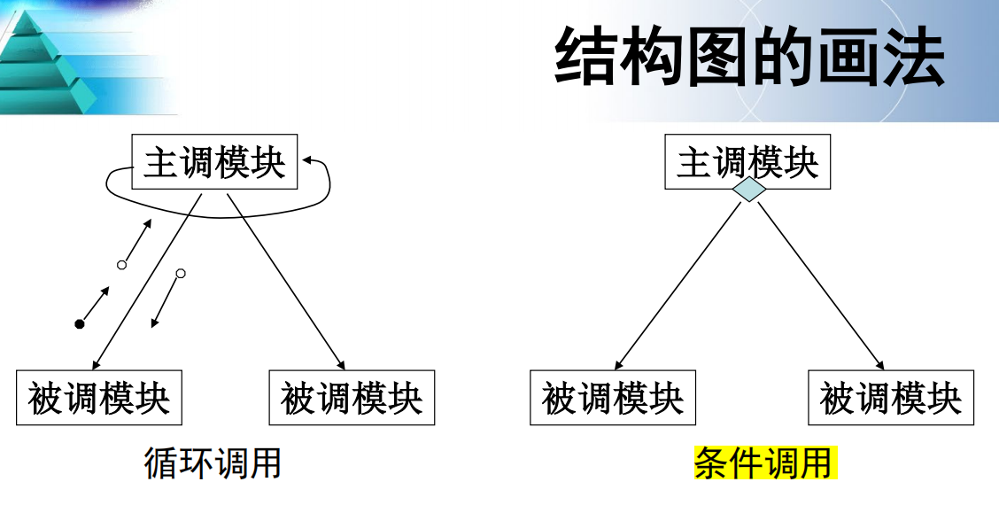
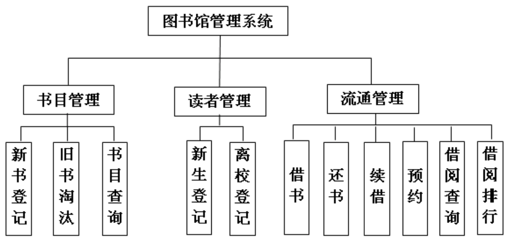
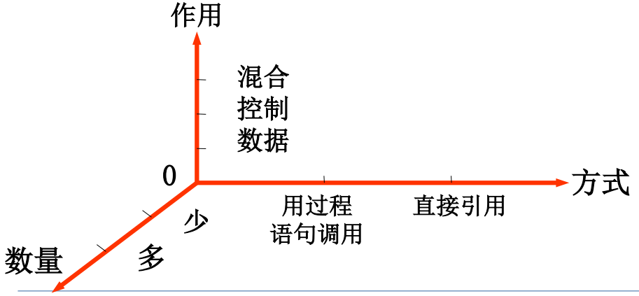
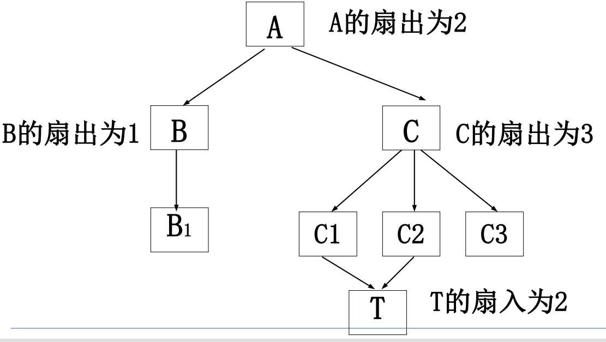
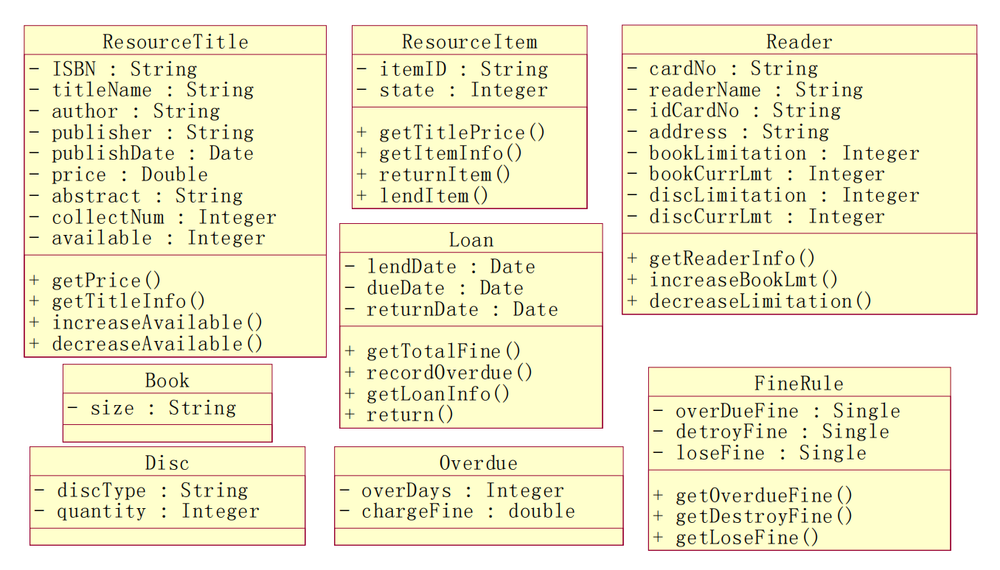
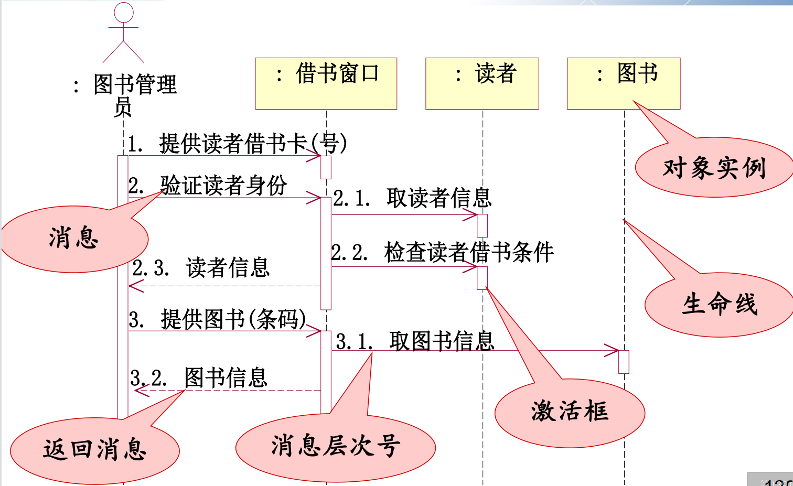

https://wenku.baidu.com/view/1847c44f081c59eef8c75fbfc77da26925c596c7.html

掌握模块的耦合方法 需要题目


最后一定有自己设计的环节 所有类型的图一定要自己设计


# 1. 系统思想

## 提纲

### 1.1

**了解系统地定义**

系统是由相互联系和相互制约的若干组成部分结合成的、具有特定功能的有机整体。

进一步解释如下：

1. 系统是由若干要素组成的，是一个集合体。

2. 系统有一定的结构同一系统的元素之间相互联系、相互作用。元素之间一切联系方式的总和，称为系统的结构（主要的、

相对稳定的、有一定规则的联系方式）

3. 系统具有特定功能凡是系统都有一定的目的性


### 1.2

**掌握系统的特性：7 点特性、内涵 *** 

整体性

层次性

目的性

稳定性

突变性

自组织性

相似性


### 1.3

**理解系统工程方法 6 个方面、霍尔三维结构每方面 7 点** 

系统工程方法：

（1）问题定义：系统研究首先要进行需求研究和环境研究。

（2）目标选择：目标选择是对问题定义的逻辑结果形成一个愿景，需要对此同目标的各种替代方案进行研究，并确定评价最优系统

的标准。

（3）系统综合：综合前人的只适合经验，发挥想象力和创造性，提出一组解决问题的方案。

（4）系统分析：依照系统目标和评价标准对系统综合提出各种方案进行分析的方案进行推理、验算得出结论，并将结论和目标进行比较从而获得不同方案对目标的实现程度，为下一阶段的最优系统选择打下基础。

（5）最优系统选择：根据系统分析的计算结果对所有的可选方案进行比较后选择最优方案，这是一个系统评价决策过程。

（6）实施计划：选择最优方案组织系统的具体实施。


霍尔三维结构


### **1.4**

**理解硬系统、软系统的定义**


**硬系统**是指具有良结构化（well-structured）的工程系统，问题和目标是确定的，能用明确的数学模型描述，可以使用定量方法计算出系统行为和最优结果。

**软系统**包括社会经济问题、企业管理问题，由于这些问题中涉及到大量人类活动，使得系统的目标难以界定，评价指标不够清楚，过程也变化不定，因此，应用传统的系统工程方法求解不是最适宜的。


## 作业

### 1.3 

> 解释下列名词：系统结构，系统功能，系统的目的性，系统的稳定性，系统的突变性，系统的自组织性，系统的相似性。

（1）系统结构：是指系统内部各组成要素之间的相互联系、相互作用的方式或秩序，即各要素在时间或空间上排列和组合的具体

形式。

（2）系统功能：系统有一定功能，特别是人造系统总有一定的目的性。功能是指系统与外部环境相互联系和相互作用中表现出来的性

质、能力和功效。

（3）系统的目的性：是系统发展变化时表现出来的特点。系统在与环境的相互作用中，在一定范围内，其发展变化表现出坚持趋向

某种预先确定的状态。

（4）系统的稳定性：是指在外界作用下的开放系统有一定的自我稳定能力，能够在一定范围内自我调节，从而保持和恢复原来的有

序状态、原有的结构和功能。

（5）系统的突变型：指系统通过失稳从一种状态进入另外一种状态的一种剧烈变化过程。他是系统质变的一种基本形式。

（6）系统的自组织性：开放系统在系统内外因素的相互作用下，自发组织起来，使系统分析从无序到有序，从低级有序到高级有序

（7）系统的相似性：是系统的基本特征，系统具有同构同态的性质，体现在系统的结构、存在方式和演化过程中具有共同性。系统的相似性体现着系统的统一性。


### 1.6

> 系统工程方法的一般步骤是什么？

（1）问题定义：系统研究首先要进行需求研究和环境研究。

（2）目标选择：目标选择是对问题定义的逻辑结果形成一个愿景，需要对此同目标的各种替代方案进行研究，并确定评价最优系统

的标准。

（3）系统综合：综合前人的只适合经验，发挥想象力和创造性，提出一组解决问题的方案。

（4）系统分析：依照系统目标和评价标准对系统综合提出各种方案进行分析的方案进行推理、验算得出结论，并将结论和目标进行比较从而获得不同方案对目标的实现程度，为下一阶段的最优系统选择打下基础。

（5）最优系统选择：根据系统分析的计算结果对所有的可选方案进行比较后选择最优方案，这是一个系统评价决策过程。

（6）实施计划：选择最优方案组织系统的具体实施。


### 1.7

> 什么是硬系统和软系统？为什么说硬系统方法不能很好的解决软系统问题？

**硬系统**是指具有良结构化（well-structured）的工程系统，问题和目标是确定的，能用明确的数学模型描述，可以使用定量方法计算出系统行为和最优结果。

**软系统**包括社会经济问题、企业管理问题，由于这些问题中涉及到大量人类活动，使得系统的目标难以界定，评价指标不够清楚，过程也变化不定，因此，应用传统的系统工程方法求解不是最适宜的。


# 2. 信息、管理与信息系统

## 提纲

### 2.1 

**掌握信息的定义。联系实际说明信息的基本属性。*** 

**信息**是指加工过的数据，它对接受者有用，对决策或行为有现实或者潜在的价值。

其有8大**属性**：

（1）事实性：收集的信息应当注重信息的事实性，一旦缺失这一点信息将变得没有价值。

（2）扩散性：它通过各种渠道向各个方向传播，信息浓度越大，扩散性越强。

（3）传输性：信息通过各种手段传输到很远的地方，他的传输性能优于物质和能源，可加快资源的传输。比如手机和网络的使用加速的信息的传输。

（4）共享性：例如股票信息为股民共享，而不是一个人所有。

（5）增值性：随着时间的推移价值耗尽，但对另一目的可能又显示用途。如：天气预报的信息。

（6）不完全性：根据需要收集有关数据，不能主次不分。、 

（7）等级性：不同级别的信息有不同的属性。不同级别的管理者对同一事物所需的信息也不同。

（8）滞后性：数据经过加工后才能成为信息。


### 2.2

**了解人进行信息处理的特点**


### 2.3

**了解管理中的信息根据管理层次的 3 类** 

管理活动一般可分为三个层次：高层/战略层、中层/战术层、基层/作业层。


### 2.4

**理解信息系统的定义*** 

**信息系统**就是输入数据，通过加工处理，产生信息的系统。以计算机为基础的信息系统是结合管理理论和方法，应用信息技术解决管理问题，为管理决策提供支持的系统。


### 2.5

**理解信息系统的功能*** 

**功能**

1. 信息的采集和输入：主要是识别、采集、校验

2. 信息的传输：数据通信的手段

3. 信息的存储：介质？在哪？时效？

4. 信息的加工：查询、排序、归并、数学模型、人工智能

5. 信息的维护：主要目的-准确、及时、安全、保密

6. 信息的使用：技术层面、价值深度


### 2.6

**理解信息系统的三种结构**

概念结构

基于管理职能的逻辑结构

基于计算机实现的物理结构


### 2.7

**了解信息系统分类方式**

 按技术发展分类

 按应用行业分类

 按管理应用分类


### 2.8

**理解信息系统在组织中的地位**

1．战略型

信息系统具战略地位的企业利用信息技术赢得竞争优势。比如沃尔玛、联邦快递等，信息技术是这些企业核心竞争力的一部分，以及谷歌、阿里巴巴、携程商务等企业的生存和发展完全依托于信息技术。

2．转变型

处于转变型定位的企业并不完全依赖于不中断的、快速响应的、有效成本下的信息技术来实现运作目标。但是新的应用信息技术和信息系统应用对实现企业战略目标来说是绝对必需的。例如一些已实施ERP的制造公司，其快速发展需要设计和实施新的信息架构才能摆脱各种困境， 信息技术将逐步转变为公司未来成功的战略性支柱。

3．工厂型

这类企业非常依赖低成本高效率的信息技术支持，信息技术已经是企业顺利运作的保障。然而信息系统的应用虽然能给他们带来丰厚的利润，但终究成为不了企业的核心竞争力。例如传统的银行业。

4．支持型

支持型定位是指信息系统对企业当前运作和未来战略的影响不大，即使企业有信息系统，但它们只是些低层面的应用，可以实现简单和零散的事务支持，如果信息系统发生运行故障甚至实施失败的话，对公司业务的继续运作不会造成很严重的影响。如传统教育机构。


### 2.9

**了解信息、管理和信息系统三者的关系**

信息、管理和信息系统三者的关系：

信息是主体

管理是目的

信息系统是手段


## 作业

### 2.4

> 什么是信息系统？举例说明某信息系统的功能

**信息系统**就是输入数据，通过加工处理，产生信息的系统。以计算机为基础的信息系统是结合管理理论和方法，应用信息技术解决管理问题，为管理决策提供支持的系统。


**功能**

1. 信息的采集和输入：主要是识别、采集、校验

2. 信息的传输：数据通信的手段

3. 信息的存储：介质？在哪？时效？

4. 信息的加工：查询、排序、归并、数学模型、人工智能

5. 信息的维护：主要目的-准确、及时、安全、保密

6. 信息的使用：技术层面、价值深度


### 2.5

> 说明数据处理系统、管理信息系统、决策支持系统、主管支持系统的各自特点。

（1）数据处理系统：支持日常运作，重复性强，逻辑关系比较简单，精度要求高。

（2）管理信息系统：一是高度集中；二是利用定量化的科学管理方法支持管理决策。

（3）决策支持系统：以交互方式支持决策者解决半结构化的决策问题。不强调全面的管理功能。

（4）主管支持系统：服务于组织的高层经理的一类特殊的信息系统，可以迅速、方便地以图文表格等多种形式提供组织的内外部信息，为经理的通信、分析、决策、组织等提供全方位的支持。


### 2.6

> 信息系统的物理结构有哪几种类型？

- 集中式结构
- 分布式结构
  - 文件服务器
  - C/S结构
  - B/S结构


### 2.7

> 解释下列名词：物料需求计划，企业资源计划，供应链管理，客户关系管理、制造资源计划。

（1）物料需求计划：MPR 是一种计算机为基础的生产计划和控制系统。他的思想是以最终产品的主生产计划和其他需求出发，根据组建之间的依赖关系，注册向下计算出各种组件的需求数量和需求时间，确定各种物料的订货时间和数量，以及生产和加工时间。

（2）企业资源计划：ERP 是建立在信息技术基础之上，利用现代管理思想，全面集成组织所有资源信息，为组织提供决策、计划、控制和经营业绩的全方位和系统化的管理平台。

（3）供应链管理：SCM 是指利用计算机网络技术全面规划供应链从供应商到最终用户中的物流、信息流、资金流，并进行计划、组织、协调与控制。

（4）客户关系管理：CRM 是一种客户为中心的管理思想和经营理念，是一种旨在改善企业与客户关系的新型管理机制，目标是通过提供更快速和周到的优质服务保持更多的客户，并通过对营销业务流程的业务管理来降低产品的销售成本。同时它又是以多种信息技术为支持手段的一套先进管理软件和技术，它将最佳的商业实践和数据挖掘、数据仓库、销售自动化以及其他信息技术紧密相结合在一起，为企业的销售、客户服务和决策支持等领域提供一个自动化的业务解决方案。

（5）制造资源计划：MRP把物流与资金流结合起来，形成生产销售，
财务，采购等紧密结合的完整经营生产信息系统，涵盖了生产制造活动的各种资源


# 3. 信息系统的建设概论


## 提纲

### 3.1

**了解系统方法在信息系统建设中的应用**

系统方法在信息系统建设中的应用：

- 还原论与整体论相结合
- 微观分析与宏观综合相结合
- 定性判断与定量计算相结合
- 严格生命周期阶段与反复迭代相结合


### 3.2

**了解常用信息系统模型**


### 3.3

**理解如何建立管理模型**

信息系统的开发本质是建立管理模型并转化为信息处理模型的过程。建立管理模型是系统分析阶段的任务，在系统设计与实现阶段，相应
的模型转换为技术方案。

管理模型描述组织的状况，包括：

- 组织的静态特征，如组织结构图、实体关系图

- 动态特征，如任务分解图、状态转换图、甘特图、PERT图 – 业务流程，如流程图

- 业务规则，如决策树、决策表


管理模型：P53

- 静态建模：E-R模型

- 动态建模：状态迁移、消息传递、对象生命周期、序列与协作Jackson system development, JSD的三个基本构件：顺序、选择、重复

- 过程建模：企业过程有输入输出；企业过程可能跨越组织边界；企业过程有层次性

- 商务规则：反映企业运作中的特定要求、必须遵循的约束和条件。


### 3.4

**掌握 UML 的全称、UML 的视图和图的分类和基本用途**

统一建模语言UML（unified modeling language）是由单一元模型支持的一组图示法。这些图示法有助于表达与设计软件系统，特别是采用面向对象方法构造的软件系统。

UML通过不同的图来描述系统的结构（structure）、行为（behavior）、交互过程（interaction）。

UML 2.2中一共定义了14种图（diagram）：

- 系统结构：类图、对象图、包图、构件图、部署图等
- 系统行为：活动图、状态图、用例图
- 交互过程：通信图、顺序图、计时图等


### 3.5

**理解信息系统的生命周期和主要步骤**


信息系统的研制可以分为５个阶段。

- 系统规划

确定信息系统的发展规划；企业业务流程的识别、改革与创新；对建设新系统的需求作出初步研究，确定信息系统的总体结构；确定系统的备选方案，对这些方案进行可行性分析

提供：可行性分析报告；系统设计任务书

- 系统分析

详细调查，确定系统的基本目标和逻辑功能要求

提供：系统分析说明书

- 系统设计

根据系统说明书中规定的功能要求，考虑实际条件，具体设计实现逻辑模型的技术方案

提供：系统设计说明书

- 系统实施

计算机等设备的购置、安装和调试；编写、调试和测试程序；人员培训；数据准备或转换；系统调试与转换

提供：实施进度报告；系统测试分析报告

- 系统维护

运行情况的记录；必要的修改；评价和总结等

提供系统运行维护记录


### 3.6

**理解基于生命周期的各种开发方法，各自优缺点**

基于生命周期的开发方法有瀑布开发方法、原型开发方法、迭代开发方法、螺旋开发方法、敏捷开发方法共 5 种。

（1）瀑布卡发方法：适用于一些需求已明确并且变化较少的信息系统

（2）原型开发方法：应用于以下场合：需求含糊，用户不能标识出详细的输入、处理和输出。需求设计方案不明确，开发人员不能确定算法的有效性、操作系统的适应性或人机交互的有效性

（3）迭代开发方法：迭代方式又分为增量迭代和进化迭代。

（4）螺旋开发方法：在技术难度较大、内容较复杂的项目中适用于螺旋迭代方法。适用于：单位内部开发的大规模软件项目、风险是项目的主要制约因素、可能会发生重大变更、采用新技术

（5）敏捷开发方法：它是一个比较通用的软件开发方法。


### 3.7

**理解基于软件技术的开发方法**

基于软件技术的开发方法：

- 结构化开发方法
- 面向数据开发方法
- 面向对象开发方法
- 面向服务开发方法


### 3.8

**掌握结构化开发方法与面向对象开发方法的比较 *** 

（1）结构化方法：容易理解和交流，对于大系统可以从全局逐步展开到局部，整体性较好。结构化方法是其他系统开发方法（如面向对象方法）的基础

（2）面向对象：稳定可靠，有利于维护和重用，并容易实现多层分布式结构，但对前期分析设计人员要求较高，用户理解模型有困难。


### 3.9

**了解诺兰模型**

诺兰模型，即信息系统进化的阶段模型。 诺兰认为，任何组织由手工信息系统向以计算机为基础的信息系统发展时，都存在着一条客观的发展道路和规律。数据处理的发展涉及到技术的进步、应用的拓展、计划和控制策略的变化以及用户的状况四个方面。1979年，诺兰将计算机信息系统的发展道路划分为六个阶段。诺兰强调，任何组织在实现以计算机为基础的信息系统时都必须从一个阶段发展到下一个阶段。

**P68**


### 3.10

**了解系统开发方式**


信息系统的开发方法从两个维度分类：

开发过程（霍尔三维结构的时间维度）
–信息系统开发过程可以根据特点按照系统工程阶段和步骤有变种，也称为不同的生存周期模型。
–方法将包含整个开发的步骤，每个步骤的任务，由什么人完成，任务的成果如何体现等内容。


开发技术及模型（知识维度和逻辑维度）
–不同的建模方法，从不同的观点来反映系统的全貌，运用学科知识和技术手段予以实现（主要是由信息技术推动的方法论体系）。


## 作业

### 3.2.1

> 对信息系统建模的目的是什么？你认为应该为哪方面建模？

- 对复杂问题进行简化描述，帮助有关人员快速、简单直观、准确地了解系统；
- 建模的过程使得分析师和设计师能更全面地研究系统，深思熟虑，减少遗漏，以形成更成熟的方案；
- 各阶段产生的模型为后续阶段的有关人员提供了工作依据；
- 为项目各类人员提供了统一的交流工具，利于沟通和团队合作；
- 为项目验收和将来的维护工作提供了文档依据；
- 利用工具将模型映射为特定平台的可执行代码（MDD，Model-Driven Development），减少开发人员工作量。

信息系统的分析与设计过程都需要建模。信息系统分析阶段建立系统逻辑模型，设计完成阶受物理模型；信息系统战略规划建立系统概念模型。


### 3.2.2

> 信息系统的研制可以分为哪几个阶段？各阶段的基本任务是什么？各阶段应该题目什么技术文档？

信息系统的研制可以分为５个阶段。

- 系统规划

确定信息系统的发展规划；企业业务流程的识别、改革与创新；对建设新系统的需求作出初步研究，确定信息系统的总体结构；确定系统的备选方案，对这些方案进行可行性分析

提供：可行性分析报告；系统设计任务书

- 系统分析

详细调查，确定系统的基本目标和逻辑功能要求

提供：系统分析说明书

- 系统设计

根据系统说明书中规定的功能要求，考虑实际条件，具体设计实现逻辑模型的技术方案

提供：系统设计说明书

- 系统实施

计算机等设备的购置、安装和调试；编写、调试和测试程序；人员培训；数据准备或转换；系统调试与转换

提供：实施进度报告；系统测试分析报告

- 系统维护

运行情况的记录；必要的修改；评价和总结等

提供系统运行维护记录


### 3.3

> 为什么说系统分析是研制信息系统最重要的阶段？这个阶段的工作困难在什么地方？系统分析员的主要职责是什么？

（１）重要性：
系统分析要回答新系统“做什么”这个关键性问题。只有明确了问题，才有可能解决问题。否则，方向不明，无的放矢，费力不讨好。

（２）团难：
系统分析的团难主要来自三个方面：对问题空间的理解，人与人之间的沟通；环境不断变化。

（３）职责：
在总体规划的基础上，与户密切配合，用统的思想和方法，对企业进行全面的调查分析，分析出现行统的不足，确定新系统的逻辑功能，找出几种可行的解决方案。


### 3.5

> 基于生命周期的开发方法有几种？各自适应于什么类型的项目？

基于生命周期的开发方法有瀑布开发方法、原型开发方法、迭代开发方法、螺旋开发方法、敏捷开发方法共 5 种。

（1）瀑布卡发方法：适用于一些需求已明确并且变化较少的信息系统

（2）原型开发方法：应用于以下场合：需求含糊，用户不能标识出详细的输入、处理和输出。需求设计方案不明确，开发人员不能确定算法的有效性、操作系统的适应性或人机交互的有效性

（3）迭代开发方法：迭代方式又分为增量迭代和进化迭代。

（4）螺旋开发方法：在技术难度较大、内容较复杂的项目中适用于螺旋迭代方法。适用于：单位内部开发的大规模软件项目、风险是项目的主要制约因素、可能会发生重大变更、采用新技术

（5）敏捷开发方法：它是一个比较通用的软件开发方法。


### 3.7

> 面向对象程序设计和结构化程序设计有什么联系和区别？

（1）结构化方法：容易理解和交流，对于大系统可以从全局逐步展开到局部，整体性较好。结构化方法是其他系统开发方法（如面向对象方法）的基础

（2）面向对象：稳定可靠，有利于维护和重用，并容易实现多层分布式结构，但对前期分析设计人员要求较高，用户理解模型有困难。


### 3.8

> 什么是面向服务的体系结构？

面向服务的体系结构（Service-Oriented Architecture，SOA）以服务为软件组成要素，服务对外定义良好的接口和契约，独立于实现服务的硬件平台、操作系统和编程语言。

从概念上讲，SOA中有三个主要的抽象级别元素：

- 操作：代表单个逻辑工作单元的事务。执行操作通常完成数据的存取和加工。与类的一个方法类似。

- 服务：代表操作的逻辑分组。例如，如果我们将客户信用视为服务，则按照客户名称获得客户信用数据、建立信用记录、更新客户信用等就代表相关的操作。

- 业务流程：为实现特定业务目标而执行的一组长期运行的动作或活动。例如：批准一项贷款、本科生转专业、完成订单等。业务流程包括依据一组业务规则按照有序序列执行的一系列操作。操作的排序、选择和执行称为服务或流程编排。


# 4. 系统规划

## 提纲

### 4.1 

**掌握系统规划的任务和系统规划的特点 *** 

系统规划的任务：

（1）制定信息系统的发展战略

（2）确定系统开发的总体方案，安排项目开发计划

（3）制定信息系统建设的资源分配计划

（4）预测未来发展，提供系统今后的发展、研究方向和准则。

系统规划的特点：

（1）面向全局、长远，不确定性，结构化程度低

（2）面向高层管理人员

（3）不宜过细，着眼于子系统划分及相互关系

（4）应与企业规划同步


### 4.2

**理解系统规划的技术和方法，掌握企业系统规划法和 U/C 矩阵构造**

- 企业系统规划法：

共4个步骤

（1）定义管理目标  			

需要调查了解企业的目标和为了达到这个
目标所采取的经营方利以实现日标的约条件能组

（2）定义管理功能组 		

识别企业在管讯过程中的主要活动

（3）定义数据分类 
		

把系统中密切相关的信息归成一类数据，
查明数据共享的关系，建立数据类功能矩阵


（4）定义信息结构		 

定义信息统子系统及其相互之间的数据交换。


- U/C 矩阵构造

矩阵表示了功和数据之间的关系：U：Use、C：Create   橙色框为子系统


### 4.3

**根据表 4.11 理解系统规划的四个主要步骤**

课本P91


### 4.4

**了解可行性论证的目的、可行分析论证的 3 个方面**

可行性研究是指在项目正式开发之前，先投入一定的精力，通过一套准则，从经济、技术、社会等方面对项目的必要性、可能性、合理性，以及项目所面临的重大风险进行分析和评价，得出项目是否可行的结论。是指在企业当前情况下，研制这个信息系统是否有必要，是否具备必要的条件。

可行性分析的内容：技术可行性、经济可行性、社会可行性。


## 作业

### 4.1

> 为什么要进行管理信息系统结构总体规划？总体规划的任务是什么？

科学的规划可以减少盲目性，使系统有良好的整体性、较高的适应性，建设工作有良好的阶段性，以缩短系统开发周期，节约开发费用。规划是指全面的长远发展计划。信息系统的系统规划又称为信息系统的战略计划，是信息系统生命周期的第一阶段，是对组织总的信息系统目标、战略、信息系统资源和开发工作的一种综合性计划，属于组织对信息系统最高层次管理的范畴，是一个组织的战略规划的重要组成部分，是关于信息系统长远发展的规划，是信息系统的概念形成期。


系统规划的任务：

（1）制定信息系统的发展战略

（2）确定系统开发的总体方案，安排项目开发计划

（3）制定信息系统建设的资源分配计划

（4）预测未来发展，提供系统今后的发展、研究方向和准则。


### 4.4

>  试述 BPS（BSP business system planning企业系统规划法） 法的 4 个基本步骤？

（1）定义管理目标  			

需要调查了解企业的目标和为了达到这个
目标所采取的经营方利以实现日标的约条件能组

（2）定义管理功能组 		

识别企业在管讯过程中的主要活动

（3）定义数据分类 
		

把系统中密切相关的信息归成一类数据，
查明数据共享的关系，建立数据类功能矩阵


（4）定义信息结构		 

定义信息统子系统及其相互之间的数据交换。


### 4.7

> 什么是 IT 治理？为什么要进行 IT 治理？

IT 治理是指设计并实施信息化过程中各方利益最大化的制度安排，包括业务与信息化战略融合的机制，权责对等的责任担当框架和问责机制，资源配置的决策机制，组织保障机制，核心信息技术能力发展机制，绩效管理机制以及覆盖信息化全生命周期的风险管控机制。

该制度安排的目的是实现组织的业务战略，促进管理创新，合理管控信息化过程的风险，建立信息化可持续发展的长效机制，最终实现信息技术的商业价值。


### 4.8

> 系统规划的一般步骤是什么？

（1）环境准备

（2）企业调查和分析

（3）信息系统调查和分析

（4）制定方向

（5）评审及方案建议


### 4.9

> 可行性的含义是什么？信息系统可行性分析包括哪些内容？

“可行性”是指在企业当前情况下，研制这个信息系统是否有必要，是否具备必要的条件。

可行性分析的内容：技术可行性、经济可行性、社会可行性。


# 5. 系统分析概述

## 提纲

### 5.1

**理解系统分析全过程：图 5.1 *** 


### 5.2

**了解问题分析的步骤**

- 明确项目的背景
- 明确项目目标、范围、相关部门和人员
- 找出关键涉众（stakeholder，也称利益相关人员）及待解决的问题。
- 涉众包括系统的用户、项目决策者、受项目影响的第三方等。
- 调查和分析业务流程，建立业务流程模型以描述用户处理业务的过程及过程中数据的流转。


### 5.3

**了解需求引导方法**

一般用户在开发之初，对所要开发的信息系统应该具有的功能和所能达到的结果并==没有清楚的认识==，因此，需求调查比现行组织系统调查难度更大。对用户进行引导和启发，让用户获得信息系统的感性认识，引导他们发现现行组织管理和业务处理中所存在的问题，从而发掘需求和找到解决方案。

采用以下需求引导方法：

- 原型法：利用快速开发工具，根据用户的初步需求，构造出信息系统的初步原型。

- 联合应用开发（JAD）会议：是一种类似于头脑风暴的技术，在一个或多个工作会议中将所有利益相关者带到一起，集中讨论和解决最重要的问题。

- 观摩法：在系统开发之初，可以让用户参观同行业或同类型成功的信息系统。用户看到这些具体系统，将会对信息系统的功能、作用、外在效果、人机交互方式等产生直观印象，这样就会引导和启发用户，通过类比思维，提出自己信息系统的需求。可采用研究类似产品或解决方案来替代观摩。


### 5.4

**了解需求有两种类型：功能性（业务性）需求和非功能性（技术性）需求**

- 功能性需求：包括系统的软件功能需求和数据需求

涉及商业应用，是系统必须完成的活动或过程，即系统功能以及相关数据。

功能性需求是根据业务过程和业务规则确定的，有些容易获取，有些则是隐含的，需要去发现。 

- 非功能性（技术性）需求：

技术性需求也称非功能性需求，是和公司的环境、硬件和软件有关的所有质量目标，包括响应时间、安全性、可靠性等。

例如：系统必须能支持100个并发用户；保存订单的时间不能超过0.5秒等等，涉及系统性能、可靠性、安全性等质量特性。

通常是一些技术目标。（偏指标）


### 5.5

**了解系统说明书的三方面内容**

引言：项目名称、目标、背景、引用资料、术语说明等

项目描述：项目的主要工作内容、现行系统的调查情况、功能需求、数据需求、其他需求

实施计划：工作任务的分解、进度、预算


## 作业

### 5.3

> 对现有系统的问题分析包括哪些内容？


- 明确项目的背景

- 明确项目目标、范围、相关部门和人员

- 找出关键涉众（stakeholder，也称利益相关人员）及待解决的问题。

- 涉众包括系统的用户、项目决策者、受项目影响的第三方等。

- 调查和分析业务流程，建立业务流程模型以描述用户处理业务的过程及过程中数据的流转。

  

问题分析：通过详细调查全面深入理解用户的业务，找出用户所问题分析：
面临的问题准确把握用户的真正的需要，为最终整理出符合用户需要的需求做准备。
需求分析：
分析员与用户充分交流，确完地获联取系统需求。
系统需求包括动能性需求和非功能性需求
该阶段整理并建立最终的需求模型，详细定义和档需求定义。
述每项需求，确认约束条件限制，编写需求规格说明。



### 5.4

> 请对高校学籍管理系统进行涉众分析。


### 5.5

> 系统说明书包括那些内容？

引言：项目名称、目标、背景、引用资料、术语说明等

项目描述：项目的主要工作内容、现行系统的调查情况、功能需求、数据需求、其他需求

实施计划：工作任务的分解、进度、预算


# 6. 流程建模

## 提纲

### 6.1

**掌握绘制业务流程图 *** 


### 6.2

**理解 BPR 和 BPM 概念**

- BPR （business process reengineering） 企业过程重组

原有流程中的大部分工作是没有给客户带来价值的，而这部分工作要被去除，而并不只是简单利用IT技术来提速的。

关注业务流程优化和变革，疾风骤雨

- BPM（business process management）业务流程管理

对企业的业务流程做一个全面梳理，明确哪些流程对企业很重要，哪些流程对企业不太重要，对所有流程进行分析、设计、描述和维护管理，并通过IT 技术和工具对流程自动化进行支持。
关注业务流程管理和持续完善，和风细雨
BPM中包含BPR的内容


### 6.3

**掌握绘制数据流图（数据流的注意事项、层次划分 3 点标准、正确性检查 4 点、易理解性 3 方面）*** 

例子：

学校对毕业设计的前期工作规定如下：
-第7学期末，教务秘书要求每个教师按照职称上报指定数量的毕设题目；
–教师提交初始题目；
–教务秘书审核后公布题目清单；
–学生可以根据题目选择指导教师；
–教务秘书收集所有学生的选择志愿，并根据学生综合测评成绩进行分配，使每个学生有一个指导教师；
–教师得到分配的学生后，与学生讨论后确定题目，于第8学期始填写任务书，交给教务秘书和学生；
–教务秘书整理所有学生毕设信息，填报毕设一览10 表，上报教务处。


要注意以下几点：

1. 关于层次的划分

   一个处理框经过展开，一般以分解为4～10处理框为宜（最好5-9个）（2个的明显是不规范）

   展开的层次与管理层次一致，也可以划分得更细。同一张图上的所有处理过程应该处于同一个抽象层次上（抽象粒度一致）

   最下层的处理过程用几句话，或者用几张判定表，或一张简单的HIPO图能表达清楚

2. 语法的正确性

   语法1：数据守恒，或称为输入数据与输出数据匹配

   语法2：在一套完整的数据流图中的任何一个数据存储，必定有流入的数据流和流出的数据流。

   语法3：父图中某一处理框的输入、输出数据流必须出现在相应的子图中。

   语法4：任何一个数据流至少有一端是处理框

3. 可读性

   - 利用数据存储简化处理间的联系

     例如：P2成绩管理->P1异动管理之间的联系可以通过D3留退名单简化，即“P2成绩管理”产生“D3留退名单”，“P1异动管理”根据“D3留退名单”完成学籍变动

   - 每层的处理框均匀分解，应齐头并进

   - 所有元素适当命名

4. 确定系统边界


### 6.4

**掌握数据字典各类条目的绘制 *** 

数据字典是对DFD的补充描述，用来描述数据流程图中的数据流、数据存储、处理过程和外部实体的详细内容。

数据字典中有六类条目：

- 可被重用的条目：

1. 数据元素

2. 数据结构

- DFD图中的元素：

3.  数据流（可引用定义好的数据结构）

4. 数据存储（可引用定义好的数据结构）

5. 外部实体

6. 处理


见课本125页


### 6.5

**掌握画判定树和判定表画法及其转化 *** 

- 结构化语言


- 判定树


  

- 判定表


### 6.6

**理解判定表的合并**

合并的原则：

取相同行动的ｎ列，若有某个条件C~i~ 在此n 列的取值正好是该条件取值的全集，而其它条件在此ｎ列都取相同的值，则此ｎ列可以合并。


# 7. 用例建模

## 提纲

### 7.1

**了解用例的概念**

用例分析是站在最终用户的角度看待系统及其特性，模型简单直接，一经提出便受到软件开发人员的青睐。

用例总是和面向对象方法放在一起讨论，并且在面向对象标准建模语言UML中用例也具有中心地位。但严格意义上讲，用例并不是一个面向对象方法论的产物，不包含面向对象思想，只是因为用例概念最初是和面向对象方法一同提出并得到广泛接受而已


基于用例的需求分析基本步骤：

\- 从系统涉众获取候选需求

\- 结合系统业务背景理解候选需求

\- 捕获信息系统功能性需求（用例模型）

\- 捕获与功能需求相关的非功能性需求或其他技术性要求


### 7.2

**掌握用 UML 绘制用例图 ***


### 7.3

**掌握用例的描述，规格说明的主要内容，并能够用用例规格说明（模板）描述用例*** 

用例规格说明Use Case Specification 的模板：

用例名称

主要参与者/次要参与者

简要描述

前置条件

后置条件

主事件流（主要成功场景/基本路径）

备选事件流（扩展路径/替代流程/异常事件流）

特殊要求/非功能性需求

发生频率

- 例


### 7.4

 **掌握用例之间的关系（包含、扩展、泛化）***

见课本P148

- 包含


- 扩展


- 泛化


# 8. 领域对象建模

## 提纲

### 8.1

**了解面向对象方法基本概念**

从面向对象的角度来看，世界就是由对象组成的。

- 任何给定的商业功能都是由一整套共同工作的对象互相协作来完成的。
- 对象不仅可以执行功能，还拥有属性（数据）。
- 计算机世界更好地映射现实世界。


- OOP

\- 面向对象的程序设计语言Simula、SmallTalk

\- C++、VB

\- Java

- OOD

\- 面向对象的软件结构设计

- OOA

\- 寻找问题领域的对象或事物


### 8.2

**掌握接口、封装、继承和多态概念 ，覆盖和重载的区别*** 

- 接口

接口（interface）是抽象类的变体。接口是一些方法的集合，但所有方法都是抽象的，只有声明而没有程序体。其它类需要实现某个接口时才对这个接口的所有方法进行定义。

接口举例：

定义一个几何计算的接口，用于计算容器的表面积和容积。

```c++
interface Math
{
    public void CalcArea();
    public void CalcVolumn();
}
//长方形箱子
class Box implements Math
{
    private float lenght,width,height;
    public void CalcVolumn()
    {
    ……
    } 
}
//圆柱桶
class Tub implements Math
{
    private float radius,height;
    public void CalcVolumn
    {
    ……
    } 
}

```


- 封装

封装即信息隐藏，它保证软件部件具有较好的模块性。
设计软件总体结构时，应尽量封装为独立的模块，每个模块对外提供接口，而尽可能少地显露其内部处理逻辑。（黑箱）
**对象**是更高一个级别的封装体，它把数据和服务封装于一个内在的整体。对象向外提供某种界面（接口），可能包括一组数据（属性）和一组操作（服务），而把内部的实现细节（如函数体）隐蔽起来


- 继承	

继承是指特殊类的对象拥有其一般类的全部属性与服务。抽取很多不同类型对象的共同点形成一般类，这个过程称为泛化（generalization）。

一般类/特殊类、父类/子类、超类/子类、基类/派生类等都是相同的概念。可以简化系统的描述和实现，较好地实
现软件重用，提高效率。

子类（特殊类）可以继承父类（一般类）的属性和操作，也可以重新定义特殊行为。

继承可分为单继承和多继承，单继承是指子类只从一个父类继承，多继承是指子类从多个父类继承。


- 多态

多态性又叫多形性，指相同的操作（或函数，或过程）可作用于多种类型的对象并获得不同的结果。
在OOP中多态的实现有两种方法：

- 由**覆盖**（override）实现动态多态，子类对父类的方法进行重写，称为运行时多态，展示的是父类及其多个不同子类的多态性。
- 由**重载**（overload）实现的静态多态，即利用重载技术在一个类中定义多个名称相同、参数类型不同的方法，称为编译时多态，是一个类中操作多态性的表现。


### 8.3

**理解类之间和对象之间的关系**

领域对象就是**问题域**中有意义的**概念类**，它们是现实系统中的事物（things）或事件（events）。
软件系统中的类一部分来自于领域对象


### 8.4

**理对象的关联，整体部分关联，和通用关联分类**

- **关联**表示不同类的对象之间的静态关系，它在一段时间内将多个类的实例连接在一起。可以使用关联表示对象了解其他对象的程度。

关联的要素：

1. 关联名称

2. 对象在关联中的角色

   

3. 多重性（数量）

   

4. 导向性（箭头）

   

- **整体部分关联**

如果对象a是对象b的一个**组成部分**，则称b为a的整体对象，a为b的部分对象，二者对应的关联形式称为整体-部分关联

整体-部分关联有两种类型：

- 组合聚集(composition aggregation ) 

  组合聚集具有很强的归属关系，在特定时刻部分只能是一个组合对象的成员。
  整体端的重数不会超过 1（即它无法被多个整体对象共享）,关系建立后一般不可变更。

  公司-----员工

  产品---零件

  

- 共享聚集 (shared aggregation)

  描述整体-部分的关系，部分可能同时属于多个整体对象。
  关联路径的末端有一个空心菱形，用来表示聚集关系。

  视频平台会员----用户

  俱乐部成员------客人

  

  


- **通用关联分类**


### 8.5

**理解泛化关系**

泛化（Generalization）是在多个概念之间识别共性，定义超类（一般概念）和子类（特定概念）关系的活动。

注错误用法：


不符合”is a kind of”且采用组装结构，将复用对象作为组成元素，滥用了泛化，应该将翅膀变为组件来使用。


### 8.6

**掌握使用 UML 图画领域对象、类图、对象的关联、泛化关系等 ***


## 作业

### 8.2

> 解释继承、封装、消息和多态性的概念。它们分别带来什么好处？

**继承**：是指特殊类的对象拥有其一般类的全部属性与服务。特殊类在继承一个一般类的语义性质外，还有自己特有的属性和操作。

好处：

1. 简化系统的描述和实现

2. 直接实现了软件的重用，提高软件开发效率


**封装**：即信息隐藏，封装使对象对外仅提供接口，即可见的一些属性和操作(public) ，而具体实现不可见。它保证软件部件具有较好的模块性。

好处：

1. 使用者只关注界面/接口，无需了解内部机制，简单易用；

2. 只要对象接口不变，对象内部逻辑的修改不会影响其它部件，便于复用，也减少了因修改引起的“水波效应”； 

3. 严密的接口保护，使对象的属性或服务不会随意地被使用，对象的状况易于控制，可靠性随之增强；

4. 开发人员一旦设计好对象的界面（接口）后，不需要等待该对象全部完成就可以进行后续开发，实现并行工作。


**消息**：消息是指向对象发出的服务请求(对象间的交互信息)。对象通过对外提供的服务在系统中发挥作用。当需要请求对象执行某种服务时，就需要向该对象发送消息。

好处：

1. 更接近人们日常思维所采用的术语，符合对象的独立自治原则

2. 在分布式环境中，对象可以在不同的网络结点上相互提供服务，消息具有更强的适应性。


多态性：多态性又叫多形性，指相同的操作（或函数，或过程）可作用于多种类型的对象并获得不同的结果。多态性一般需要建立在继承机制之上。

好处：

1. 当给不同子类型的对象发送相同的消息时，消息的发送者可以不用关心具体的对象类型，而由对象自身做出不同的响应处理。

2. 需要扩充一种新类型时，只需要从父类中再派生出一个子类，覆盖父类的某些服务，而不需要改动其它外部程序。

3. 多态性极大地提高了重用性和灵活性，对象的使用和理解也得以简化。


### 8.6

> 对象关联如何确定？类图中如何表示对象关联？

关联表示不同类的对象之间的结构关系，它在一段时间内将多个类的实例连接在一起。关联体现的是对象实例之间的关系，而不是表示两个分类之间的关系。	

常使用关联名称、角色、多重性和导向性来说明关联。

对象关联在类图中的表示：	

1.多数关联式二元的，即只存在于两个类的实例之间，在图中表示为连接两个类符号的实线路径。

2.关联路径的两端是角色，角色规定了类在关联中所起的作用。每个关联都必须有名称，而且对应一个类的所有角色名称都必须是唯一的。

3.多重性表明了该类的多少个对象在一段特定的时间内可以与另一个类的一个对象相关联

4.导向性用一个箭头表示，该箭头置于关联连接的目标端，紧靠目标类。


### 8.7

> 泛化关系如何确定？类图中如何表示对象关联？

泛化是在多个概念之间识别共性，定义超类（一般概念）和子类（特定概念）关系的活动。如果类 A 具有类 B 的全部属性和行为，而且具有自己特有的某些属性或服务，则 A 叫做 B 的特殊类，B 叫做 A的一般类。这种关系也称为一般-特殊关系、泛化-特化关系、继承关系。

泛化关联在类图中的使用：

1. 类的一般-特殊关系使用空心三角连接直线表示，三角形一端是一般类，另一端是特殊类。
2. 聚集关系由空心菱形连接直线表示，菱形一端为整体对象，另一端为部分对象，两端可表示多重性。
3. 组成关系由实心菱形连接直线表示，是聚集的特例，表示整体与部分紧密依赖的合成关系，菱形一端多重性为1。

4. 使用抽象概念类如果一个类 A 的每一个成员必须同时是其子类的成员，那么称 A 为抽概念象类。

5. 多继承泛化关系中有多继承和单继承。多继承是指一个子类继承了两个父类的属性和行为。


### 8.9 

> 对于一个餐馆点餐和结账系统，可以识别出哪些概念类？各自有哪些属性？

大致可以识别出3个基本概念类：

1. 菜品

名称
单价
状态


2. 顾客订单

订单编号
桌号
折扣
金额
开单时间
记账人
状态


3. 预定记录

预定编号
姓名
电话
预定时段
预定类型
抵达时间
状态


其中订单包含了菜品，可以将上面3个基本概念类绘制如下：


### 8.11

> 搜集更详细的大学教务管理的有关文档，识别出大学教务管理系统中的概念类，并绘制类图。

大学教务管理系统的参与者主要有学生，老师和教务员

主要的概念类有课程和成绩

类图绘制如下：


# 9.系统设计概述

## 提纲

### 9.1

**理解系统设计的目标 *** 

设计系统之前，先看看评价信息系统的标准，这些标准对任何设计方法都适用：

1. 信息系统的功能：是否满足用户的需求
2. 系统的效率：响应时间、操作的方便性
3. 系统的可靠性：抗干扰能力、故障恢复
4. 系统的工作质量：准确性、使用效果
5. 系统的可变更性：修改和维护的难易程度
6. 系统的经济性：系统收益与支出比


### 9.2

**掌握系统设计的内容 *** 

一般划分为两部分：

- 总体设计
  - 设计软件的体系结构（也称架构，architecture）
  - 设计软件结构，即具体组成元素及其关系（structure） 
  - 设计系统对外接口和服务

- 详细设计

  各项具体细节，涉及软硬件的各个方面


### 9.3

**理解系统设计师的素质要求**

- 创造性设计思维；
- 丰富的编程经验和很强的逻辑思维能力；
- 具备将复杂的问题分解成简单问题的能力，设计易于使用和维护的软件结构，并保证较好的重用性；
- 应对系统结构尤其是软件结构具有较强美感，善于运用巧妙优美的设计模式；
- 应有大局观，懂得平衡各种开发局限的制约，权衡时间、进度成本与系统质量、性能等因素提出最佳方案。


### 9.4

**了解软件结构的演变**


## 作业

### 9.1

> 怎样理解系统分析和系统设计的区别

**系统分析**阶段要回答的中心问题是系统“做什么”，即明确系统功能，这个阶段的成果是系统的逻辑模型。

**系统设计**要回答的中心问题是系统“怎么做”，即如何实现系统说明书规定的系统功能。在这一阶段，要根据实际的技术条件、经济条件和社会条件，确定系统的实施方案，即系统的物理模型。


### 9.4

> 什么是总体设计 ?信息系统总体设计的内容包括哪些方面？

总体设计也称为概要设计，任务是设计出系统的主要框架，即组成物理系统的主要成分及其关系。主要包括如下几个方面：

1）系统体系结构设计：也称为系统构架。需要设计系统硬件和软件最高层的解决方案，对系统划分和组成成分最抽象的规定，设计多层物理结构和多层逻辑架构。

2）系统结构设计：指系统具体组成元素及其关系的设计。


### 9.5

> 信息系统详细设计包括哪些内容？

1）各分支技术的细节

2）输入输出的设计

3）人机交互设计

4）程序处理过程详细设计

5）数据库设计

6）代码体系设计

7）计算机系统和网络设计


### 9.6

> 系统设计阶段的成果如何体现？

系统设计完成的阶段成果是系统设计书。

系统设计书有两种形式：

1. 单册文档，分章节介绍系统架构、总体结构、编码体系、输入/输出、人机交互、数据库、网络等各部分内容

2. 多册文档，以上各部分单独书写成册，如总体设计报告、用户界面设计报告**、**数据库设计报告**、**网络详细设计报告等


# 10. 系统总体设计


## 提纲

### 10.1

**理解架构、软件架构的概念**

架构包含系统的一组**基本结构**（structure），每种结构都有各种类型的部件（component）及其**关系构成**，架构描述了这些部件的组合、相互调用参照、通信以及其他动态交互。

**软件架构**（software architecture）的定义没有统一的版本，一般认为：一个应用程序或计算系统的软件架构是一个或一组结构，它包含组成系统的软件元素、这些元素对外可见的性质以及它们之间的关系。对外可见的性质指软件元素能够提供的服务、性能特征、错误处理、共享资源的用法等。

软件的一个结构元素可能是一个子系统、构件、进程、库、数据库、计算结点、遗留系统等等。

软件架构是**最高层次的系统分解**，它不会囊括所有的结构和行为的定义，它只关注那些被认为是重要的元素。 

架构难以更改，一旦修改，意味着整个系统重建，而结构修改只影响局部。


### 10.2

**了解多层应用架构设计、三个基本层次、MVC 架构模式 3 个基本部件**

经典的三层架构
1. 表现层：处理用户和信息系统之间的交互。

可以是简单的命令行窗口，也可以功能完善的图形用户界面（胖客户端程序），如基于HTML的浏览器界面（瘦客户端程序），也可以是手机界面。

2. 业务逻辑层：也称为领域层或应用层，是信息系统所有和领域相关的工作。

如根据输入数据或已有数据进行计算，可以是类库或Web服务。依赖于数据访问层获取数据或保存数据。

3. 数据访问层：一般指与数据库的交互，主要责任是   数据库记录的存取。

如组件中包含专门的数据访问类，或每个表对应一个数据访问类


MVC架构模式与三层架构模式有相似的地方，但不完全遵守层的基本规则，其出发点也是实现业务逻辑、数据和表示的代码分离。分成一下三个部分：

- 模型：代表数据，使用对象及其属性实现。

- 控制器：是模型与视图的联系纽带，客户的请求由控制器处理，它根据客户的请求调用模型的方法，完成数据更新，然后调用视图的方法将响应结果展示给客户。相应的，模型的更新与修改将通过控制器通知视图，保持视图与模型的一致性

- 视图：是模型的外在表现形式，视图可以直接访问模型；查询数据信息，当模型中数据发生变化时，它会通知视图刷新界面，显示更新后的数据。


### 10.3

**理解软件框架的概念 *** 

“不要重复发明轮子”
软件复用：
‒从代码角度（开发态）看有子过程、函数、类等
‒从部署角度（运行态）看有类库、Web服务等二进制可执行组件、中间件和平台
架构模式同样可以复用，当架构模式的复用形式不仅仅停留在逻辑层面，而以物理的二进制组件的方式提供重用时，就产生了框架。


软件框架（software framework）是对整个或部分
系统可重用的设计和实现。 框架可以选择对某种架构模式的基本结构和接口机制进行编程实现，不仅封装该架构模式的基本元素
对外提供类库，还封装底层公用的流程控制逻辑，从而直接为应用软件提供了最初的骨架。
框架就是一个半成品软件平台，软件框架和应用软件：
‒ 八股文/元芳体 与 具体文章
‒ 汽车流水线 与 汽车


### 10.4
**了解什么是包、包的分类原则**

包：包是一种逻辑分组手段，可以取UML模型中的任何一种事物，将相关成分聚在一起，以构成更高层的组织单元——包。包采用自动向下的设计方法，是一种将系统分解为较大的部件的一种分组机制。


分包（软件类的分组）有两种原则：
‒ 共同封闭原则（Common Closure Principle）。一个包中的各个类应该是由于相似的原则而改变，即将一组职责相似、但以不同方式实现的类归为一个包中。比如按照层来进行分包就是这种类型。
‒ 共同复用原则（Common Reuse Principle）。一个包中的各个类应该一起被复用，复用其中一个可能需要同时考虑同一个包中的其它协作类。通常和业务功能相关。


### 10.5
**了解接口概念**

词典释义
‒两个不同系统(或子程序)交接并通过它彼此作用的部分。

人类与计算机之间的接口称为**用户接口**。

计算机硬件元件间的接口叫**硬件接口**。
计算机软件元件间的接口叫**软件接口**。

‒内部接口：系统内部各元件间的接口
‒外部接口：系统对外提供给其他系统使用的接口
‒API：应用编程接口（Application Programming Interface），一种应用程序提供的外部接口的说法


------

具体设计方法

==结构化设计方法==

### 10.6
**掌握模块的概念**

模块(Module)一词使用很广泛。通常对应于用一个名字就可以调用的一段程序语句（子程序或函数）。

模块具有输入和输出、逻辑功能、运行程序、内部数据四种属性。


### 10.7
**了解结构图画法**



结构图无严格的模块调用顺序，但一般习惯从左至右
因为约定遵从从上向下的调用，调用关系也可以不使用箭头，而直接使用直线
模块间传递的信息如果出现在数据字典中，则视为数据，否则为控制信息


结构图中的主要成分有：

- 模块：用长方形表示
- 调用：从一个模块指向另一模块的箭头表示前一个模块调用后一个模块。有循环调用和条件调用
- 数据：用==带圆圈==的小箭头表示从一个模块传递给另一模块的数据（有实义）
- 控制信息：带==涂黑圆圈==的小箭头表示一个模块传送给另一模块的控制信息


忽略信息传递的结构图：




### 10.8
**掌握模块的耦合方法*** 

耦合分类如下：

- 数据耦合：采用子程序调用，调用模块将需要进行处理的数据传递给被调模块。数据耦合是不可避免的。
- 标记耦合：如果调用模块将整个数据记录传递给被调模块，而被调模块只使用了部分数据项，则称为标记耦合或特征耦合。
- 控制耦合：一个模块将控制信息传递给另一个模块，以控制被调模块的内部处理逻辑。（可以分解）
- 公共环境耦合：如果两个模块共享同一全局数据，称为公共耦合。
- 内容耦合：两个模块之间的内部属性有直接关联，也称病态耦合。（某些GOTO语句）




离坐标原点越远，耦合程度越高


如果使用模块A需要了解模块B，那么A和B是耦合的。影响模块间耦合程度有三方面的因素：

- 联系方式－－模块间通过什么方式联系
- 来往信息的作用－－模块间来往信息作什么用
- 数量－－模块间来往信息的多少。


### 10.9
**了解模块的内聚方法**

模块的内聚反映模块内部联系的紧密程度。一个模块只需要做好一件事情，不要过分关心其它任务。

高内聚性的好处是可以提高程序的可靠性。有一个调查表明，50％的强内聚性子程序是没有错误的，而只有 18％的弱内聚性子程序才是无错的，弱内聚性子程序的出错机会要比强内聚性出错机会高 6 倍，而修正成本则要高 19 倍。摘自《代码大全》

模块的内聚可以分以下七类：
１、偶然内聚(coincidental cohesion)
２、逻辑内聚(Logical cohesion)
３、时间内聚(temporal cohesion)
４、步骤内聚(procedural cohesion)
５、通信内聚(communicational cohesion)
６、顺序内聚(Sequential cohesion)
７、功能内聚(functional_cohesion)


### 10.10
**了解模块的扇入和扇出含义**

模块的扇入是指有多少个上级模块调用它。

模块的扇出是指模块的直属下层模块的个数，扇出系数不宜过大




### 10.11
**了解不同类的职责分配**

职责有两种类型：

1. 行为型：即对象本身的方法。比如进行一项计算、被创建时的初始化、执行控制或协调的各项活动。
2. 了解型：对象应掌握的信息。比如对象自身的数据和属性、相关联的对象以及能够派生或计算的对象（set/get方法），如Loan类需要了解借出和归还日期（属性），以及所借资源的有关情况，即ResourceItem或ResourceTitle对象（关联对象）。


### 10.12
**掌握面向对象设计方法，UML 绘制类图和顺序图，包括类的属性和方法，消息调用**

类图




• 类中的每个属性可以有可见性定义，指定该属性可以被
其它类利用的程度，
• UML定义了4种属性可见性：
• 公有（public） “+”
• 受保护（protected） “#”
• 私有（private） “-” • 包（package) “~”

顺序图：




### 10.13
**理解类的四种关系设计：泛化（类），关联（对象），实现（类），依赖（对象）**

1. 泛化设计
    泛化在面向对象语言中使用继承来实现，继承机制实现了子类拥有父类特性的这一过程。泛化设计还有一个更重要的目的在于如何实现多态性。

2. 关联设计

  实现对象关联的一个简单策略就是：
  在关联的源类中声明一个属性来保存对目标类的实例的引用，这种属性称为关联属性或引用属性。
  根据关联的导航性，有单向关联和双向关联。
  根据关联重数，有一对一、一对多和多对多关联，多对多关联通过建立关联类分解成1对多的关联。
  限定关联。

3. 接口与实现的设计
    所有的实体类都具有这些数据库操作行为，将这些操作抽象出来封装到一个IEntityOperate接口中

4. 依赖设计
    在类图中依赖关系通常指明一个类的对象实例使用了另一个类的属性和方法。
    界面层使用了控制层对象，控制层对象使用了数据访问层对象。


### 10.14
**了解面向服务设计方法的概念，SOA 概念4**

SOA（Service-Oriented Architecture） ‒ 是一种架构模式，系统基于服务构件来开发，多个服务通过它们定义良好的接口和契约联系起来。

最早由Gartner公司于1996年提出SOA概念时，是这样描述的：“客户端/服务器的软件设计方法，一个应用系统由软件服务和软件服务使用者组成……SOA与大多数通用的客户端/服务器模型的不同之处在于它着重强调软件构件的松散耦合，并使用独立的标准接口。”

- 狭义的SOA：一种IT架构风格，是以业务驱动、面向服务为原则的分布式计算模式。
- 广义的SOA：包含架构风格、编程模型、运行环境和相关方法论等在内的一整套企业应用系统构造方法和企业环境，涵盖分析、设计、开发整合、部署、运行和管理等整个企业信息系统建设的生命周期。


### 10.15
**了解设计原则、设计模式**

设计原则：

总的原则
‒ 抽象与复用（封装、信息隐藏）
‒ 松耦合

面向功能模块
‒ 设计功能内聚的模块，避免使用全局数据
‒ 模块传递的参数作数据用，并且尽可能少
‒ 模块内语句数一般为50-100

面向对象
‒ 单一职责、开放封闭、里氏替换、依赖倒置…  面向服务
‒ 标准化服务合约、服务松散耦合、服务抽象、服务可复用、服务自治、服务无状态、服务可发现性和服务可组合性


GoF23种设计模式
由四人组的专著《设计模式》一书总结了广为应用的23种设计模式，每种模式解决了一个特定问题，包括一组合适的对象和对象接口，及对象间协作的方式。


### 10.16
**了解高内聚模式、低耦合模式**

**松耦合原则**：任何事物只要相互之间存在某种关系，就意味着事物间的耦合。在设计时应尽量减少系统各部件在功能上、数据上或结构上的相连关系，应严格规定上层构件或类依赖下层构件或类提供的服务，但下层不依赖于下层，从而使下层部件更易复用。


**单一职责原则**：即内聚性原则。高内聚原则可以从模块设计引申到类的设计。一个类承担的职责过多，某个职责的变化可能会削弱或者抑制该类完成其他职责的能力，并影响到构建、测试和部署等活动。多个职责的耦合会导致脆弱的设计，当变化发生时，设计会遭到意想不到的破坏。

模块的内聚反映模块内部联系的紧密程度。
一个模块只需要做好一件事情，不要过分关心其它任务。高内聚性的好处是可以提高程序的可靠性


### 10.17
**了解 Gof 模式**

GoF23种设计模式
由四人组的专著《设计模式》一书总结了广为应用的23种设计模式，每种模式解决了一个特定问题，包括一组合适的对象和对象接口，及对象间协作的方式。


## 作业

### 10.3

> 解释多层软件架构模式和MVC架构模式

1. 多层软件架构模式：

层次模型的理念就是将整个任务横向划分为不同级别，而不是纵向。**多层软件架构模式**是指基于组件的软件开发，组件根据横向位置划分为多层。该模式遵循如下规则：

- 下层组件负责对上层组件提供服务

- 上层组件可以使用下层组件定义的服务，但下层组件对上层组件一无所知。

- 层与层之间通常是不透明的，每一层都具有独立的职责

- 不同层的软件构件可以分布在多台机器上，也可以部署在同一台机器上，形成物理上的多层

在信息系统领域最常用的三层架构。三层架构中分为表现层、业务逻辑层和数据表现层。随着业务逻辑越来越复杂，三层架构也可以扩展为4/5层架构。五层架构分为控制层、中介层、领域层、数据映射层和数据访问层。


2. MVC架构模式：

MVC架构模式与三层架构模式有相似的地方，但不完全遵守层的基本规则，其出发点也是实现业务逻辑、数据和表示的代码分离。分成一下三个部分：

- 模型：代表数据，使用对象及其属性实现。

- 控制器：是模型与视图的联系纽带，客户的请求由控制器处理，它根据客户的请求调用模型的方法，完成数据更新，然后调用视图的方法将响应结果展示给客户。相应的，模型的更新与修改将通过控制器通知视图，保持视图与模型的一致性

- 视图：是模型的外在表现形式，视图可以直接访问模型；查询数据信息，当模型中数据发生变化时，它会通知视图刷新界面，显示更新后的数据。


### 10.4 

> 名词解释：包，子系统，构件。

1. 包：包是一种逻辑分组手段，可以取UML模型中的任何一种事物，将相关成分聚在一起，以构成更高层的组织单元——包。包采用自动向下的设计方法，是一种将系统分解为较大的部件的一种分组机制。


2. 子系统：按照相对完整和独立的业务功能或管理职能组织包，并对这样的包进行封装后，构成的一个高层的具有特定功能的可以运行的独立构件称为子系统。


3. 构件：构件是系统中实际存在的可更换部分，他实现特定的功能，符合一套接口标准并实现一组接口。构件是可复用的软件组成成份，可被用来构造其他软件。


### 10.6

> 什么是模块间的耦合？怎样度量耦合的高与低？

耦合是影响系统复杂程度的一个重要因素。若为了理解模块 A，必选要对模块 B 有所了解，那么就说模块 A 和模块 B 有联系。如果需要对 B 的理解越多，则我们称 A 和 B 的耦合越紧。

影响块间耦合程度有下面三方面因素：

- 联系方式：模块间通过什么方式联系

- 来往信息的作用：模块间来往信息作什么用

- 数量：模块间来往信息的多少

我们用上面的三个指标来衡量耦合程度的高低。


### 10.7 

> 什么是模块间的内聚？模块间的内聚有哪些内容?

模块之间的内聚反应内部联系的紧密程度。如果一个内部相关性很高的，而且都是为了同一个功能，就说他的内聚程度越高。

内聚的内容如下：

1) 偶然内聚

2) 逻辑内聚

3) 时间内聚

4) 步骤内聚
5) 通信内聚

6) 顺序内聚

7) 功能内聚


### 10.9

> 举例说明边界类、控制类和实体类的职责。根据三层架构模式为选课系统设计必要的软件类。

1. 边界类的职责是完成系统与其参与者之间的交互。

   对于图书系统来说，目前所有的参与者都是系统的用户，因此边界类只有窗口界面这一种形式。

2. 实体类来源于领域模型中的类。

   在图书管理系统中“读者”实体类、“借书用户界面”边界类和参与者的协作关系。“借书用户界面”负责信息的显示，业务逻辑比如“验证合法性”、“提供信息”等是实体类“读者”的职责。

3. 控制类代表协调、排序、事物处理以及对其他对象的控制，经常用于封装与某个具体用例有关的控制流。


对于选课系统可以设计如下：

**表现层**

学生选课窗口

教务处管理窗口


**业务逻辑层**

验证合法性类

选课业务类

退课业务类

查询课程类


**数据访问层**

学生类

课程类

课程列表类


### 10.10

> 何为设计类的方法？为上述选课系统中的类设计方法。

设计类的方法也就是设计软件对象所要执行的操作。

我们借助交互图为类设计方法：

- 交互图中的消息映射为接受消息的对象类的方法（操作）
- 消息表达式中的参数和返回值等映射为类方法函数的参数和返回值


选课系统中主要的类设计方法如下：

**业务逻辑层**

验证合法性类

- 身份认证


选课业务类

- 选课


退课业务类

- 退课


查询课程类

- 查询课程


**数据访问层**

学生类：

- 获取学生信息

- 增加选课

- 减少选课

- 获取已选课程


课程类

- 获取课程信息

- 增加学生

- 减少学生

- 获取已选学生


### 10.11 

> 顺序图的作用是什么？包含哪些元素？

顺序图用于描述涉及用例实现的多个对象实例以及对象之间交互时传递的消息，并按照用例的执行步骤为顺序指明对象的交互顺序。顺序图的基本元素有参与者、对象、生命线、激活框、消息、控制框架、分支片段等。


### 10.13

> 为选课系统的某个功能（用例）绘制顺序图

下面绘制学生选课功能的顺序图


### 10.15

> 为选课系统设计服务和接口

选课系统主要提供了4个服务

1. 选课信息查询

   输入参数：学号、密码

   输出参数：选课信息（姓名、已选课程、已修课程）

   其他说明：该服务用来获取学生的选课信息，可以被其他服务调用

2. 课程信息查询

   输入参数：课程编号

   输出参数：课程信息（课程名称、已选人数、教师、上课地点）

   其他说明：该服务用来获取课程信息，可以被其他服务调用

3. 选课

   输入参数：学号、密码、课程编号

   输出参数：选课是否成功

4. 退课

   输入参数：学号、密码、课程编号

   输出参数：选课是否成功

     

所有的实体类都具有这些数据库操作行为，将这些操作抽象出来封装到一个IEntityOperate接口中

```java
public interface IEntityOperate
{ 
    int Insert(); //插入对象数据到数据库中
    int Update(); //更新对象数据到数据库中
    int Delete(); //删除数据库中指定对象数据
}
```


### 10.16

> 解释以下设计原则：松耦合原则，单一职责原则，开放—封闭原则，Lidkov 替换原则，依赖倒置原则。

**松耦合原则**：任何事物只要相互之间存在某种关系，就意味着事物间的耦合。在设计时应尽量减少系统各部件在功能上、数据上或结构上的相连关系，应严格规定上层构件或类依赖下层构件或类提供的服务，但下层不依赖于下层，从而使下层部件更易复用。


**单一职责原则**：即内聚性原则。高内聚原则可以从模块设计引申到类的设计。一个类承担的职责过多，某个职责的变化可能会削弱或者抑制该类完成其他职责的能力，并影响到构建、测试和部署等活动。多个职责的耦合会导致脆弱的设计，当变化发生时，设计会遭到意想不到的破坏。


**开放—封闭原则：**软件实体应该是可以扩展的，但是不可修改的。开放—封闭原则要在模块本身不变动的情况下，通过改变模块周围的环境达到修改目的。“对于扩展是开放的”，当应用的需求改变时，在模块上进行扩展使其具有满足那些改变的新行为；“对于更改时封闭的”，当模块进行扩展时，不必改动模块的源代码或二进制代码。


**Liskov 替换原则：**LSP 是多态顺利实现的保证，从而使 OCP 成为可能。因为正是子类型的可替换性才使得使用基类的模块在无需修改的情况下就可以扩展。增加或修改任何一个子类型，基类不用修改（封闭）基类的使用者（客户程序）通过多态得到扩展或修改过的行为（开放）。


**依赖倒置原则：**高层模块不应该依赖于低层模块，二者都应该依赖于抽象；抽象不应该依赖于细节，细节应该依赖于抽象。


# 11. 系统详细设计

## 提纲

### 11.1

**了解详细设计五个方面**

包括系统的输入输出设计、用户界面设计、数据库设计、程序处理过程设计、网络系统设计、安全性设计等方面的内容。

1. 输出设计
2. 输入设计
3. 人机交互设计
4. 计算机处理过程的设计
5. 数据库设计
6. 代码设计
7. 网络和计算机系统设计


### 11.2

**了解输出设计**

输出设计包括：

1. 确定输出内容

   根据用户要求，设计输出信息的内容，包括信息形式（图片、表格、文字），输出项目以及数据结构、数据类型、位数及取值范围，数据生成路径等。

2. 选择输出设备与介质

   根据用户对输出信息的要求，结合现有的设备和资金条件选择

3. 确定输出格式。

   提供给人的信息都要进行格式设计，要满使用者的要求和习惯，让格式清晰、美观、易于阅读和理解。


### 11.3

**了解输入模式**

批量集中输入

联机分散输入

混合方式


### 11.4

**了解顺序图、流程图和盒图**
### 11.5

**理解数据库设计的三个范式*** 

### 11.6

**了解物理设计**

### 11.7
**了解代码设计**


## 作业

### 11.2

> 系统详细设计的任务是什么？包括哪些内容？

系统详细设计是为系统的每项具体任务选择适当的技术手段和处理方法。系统详细设计是模块详细设计，需要对每个模块（ method 或function）的内部处理逻辑进行设计。当软件结构以类为单位时，总体设计定义了类及关系，顺序图描述了类之间的协作，但类的某个方法内部处理逻辑很复杂时，也需要进行模块详细设计。


详细设计要考虑各个方面和部件内部细节的方案，包括系统的输入输出设计、用户界面设计、数据库设计、程序处理过程设计、网络系统设计、安全性设计等方面的内容。


### 11.3 

> 输出设计包括哪些内容？

输出设计包括：

1. 确定输出内容

   根据用户要求，设计输出信息的内容，包括信息形式（图片、表格、文字），输出项目以及数据结构、数据类型、位数及取值范围，数据生成路径等。

2. 选择输出设备与介质

   根据用户对输出信息的要求，结合现有的设备和资金条件选择

3. 确定输出格式。

   提供给人的信息都要进行格式设计，要满使用者的要求和习惯，让格式清晰、美观、易于阅读和理解。


### 11.6

>  计算机处理过程的详细设计可以使用什么模型或工具？

设计过程可使用的模型有：顺序图、程序流程图（程序框图）、盒图（NS图）、程序设计语言（PDL）。

处理过程设计的关键是用一种合适的模型来描述程序的动态执行过程。这种模型应该简明、精确,并由此能直接导出用编程语言表示的软件代码。根据处理过程的特点来选择有充分表达能力的模型，如果处理多个对象的协作流程，则使用 UML 顺序图表示；如果要表达一个独立函或类的内部方法的算法，则可以使用传统的程序流程图或者盒图；为了比较灵活的描述模块内部具体算法，也可以使用程序设计语言（PDL）。


### 11.7

> 数据库设计包括哪些内容？

数据库设计包括：

1. 设计关系数据模型 

   用关系表示实体和实体之间联系的模型称为关系数据模型

2. 关系数据库规范化 

   关系数据库规范化是为了设计关系良好的数据库，根据关系模式满足的不同性质和规范化的程度，把关系模式分为第一范式、第二范式、第三范式、BC范式、第四范式，范式越高、规范化程度越高，关系模式越好

3. 数据库物理设计 

   数据库物理设计的内容是设计数据库存储结构和物理实现方法，包括数据储量、设备和储存方案、设计索引、服务器程序、备份策略、安全策略、镜像方案等

4. 对象——关系映射 ORP

   对象——关系映射是为了解决对象与数据库需要快捷便利地相互转换而开发的技术。


# 第12章

## 12.1

> 系统实施包括哪些主要任务？

主要包括以下几个方面的任务：

1. 硬件准备 

2. 软件准备 

   程序开发及测试 

   软件产品安装部署 

   软件的客户定制 

   租用服务

3. 人员培训 

4. 数据准备


## 12.7

>  程序 TRIANGLE 输入 A,B,C 三个实数，他们表示三角形的三个边，该程序产生了一个结果，指出该三角是等腰三角形、等边三角形还是不等边三角形。为测试程序的正确性，你能举出哪些测试用例？

要设计测试用例我们可以从以下的角度来思考：

1）从逻辑覆盖考虑

逻辑覆盖是以程序内部的逻辑结构为基础的设计测试用例的技术，属于白盒测试。根据覆盖测试的目的不同，逻辑覆盖分为：语句覆盖、判断覆盖、条件覆盖、条件组合覆盖、路径覆盖。 由于该题目没有提供程序的源代码，故不能从逻辑覆盖的角度来设计用例。


2）从等价类划分考虑

等价类划分是一种典型的黑盒测试方法，使用这一方法时，完全不考虑程序的内部结构，只依据程序的规格说明来设计测试用例。等价类划分方法把所有可能的输入数据，即程序的输入域划分成若干部分，然后从每一部分中选取少数有代表性的数据做为测试用例。 使用这一方法设计测试用例要经历划分等价类（列出等价类表）和选取测试用例两步。

1. 是等腰三角形

   [(10,8,8)，等腰三角形 ]

   [(7,8,8)，等腰三角形 ]

2. 是等边三角形

   [(8,8,8)，等边三角形 ]

3. 是不等边三角形

   [(6,8,7)，不等边三角形]


3）从边界值分析法考虑

 边界值分析也是一种黑盒测试方法，是对等价类划分方法的补充。人们从长期的测试工作经验得知，大量的错误是发生在输入或输出范围的边界上，而不是在输入范围的内部。因此针对各种边界情况设计测试用例，可以查出更多的错误。

考虑输入不是三角形的情况

[(10,1,2)，不是三角形 ]

[(-10,8,9)，不是三角形 ]

[(-10,9,9)，不是三角形 ]

[(10,1,1)，不是三角形 ]

[(a,b,c)，不是三角形 ]（非数字输入）


## 12.8 

> 系统转换有哪些方式？这些方式各有什么优缺点？

系统转换有三种方式：

**直接转换方式**：直接转换指在某一时刻，老系统停止运行，新系统立即开始运行。

​	优：切换方式简单，用户没有重复劳动，最省费用；

​	缺：风险高，结果无比较性。

**并行方式：**是新老系统并行工作一段时间，经过这段时间考验，以后新系统代替旧系统。

​	优：风险小，有安全感，可以将结果进行对照；

​	缺：重复劳动，费用高。

**分段切换方式**：该切换方式是前两种切换方式的结合。在新系统正式全部运行前，一部分一部分代替老系统。

​	优：低风险，比并行节省费用，可以积累经验，能循序渐进。

​	缺：新旧系统的子系统间、功能间接口多，实施复杂，技术成本高。一般较大系统采用。


# 第13章

## 13.2

> 系统维护包括哪些内容？系统维护分哪几种类型？

**系统维护的内容包括：**

1. 程序维护：也称为软件维护，是对程序的一些改动

2. 数据维护：数据的更新，备份与恢复，以及由于业务或环境的变化而引起数据结构的调整 

3. 代码维护：出现新的事物对象，或旧的代码体系无法适应，一般如果只是增加新的代码类，程序在某些情况下根本不需维护，但如果代码体系发生变化，也要进行程序维护 

4. 硬件维护：修理或更新等


**系统维护包括四种类型**：

1. 纠错性维护：在软件交付使用后，因开发时测试的不彻底、不完全，为了识别和纠正软件错误、改正软件性能上的缺陷、排除实施中的误使用，应当进行的诊断和改正错误
2. 适应性维护：为使软件适应外界环境变化而修改软件的过程
3. 完善性维护：为满足用户对软件提出新的功能与性能要求进行的维护
4. 预防性维护：为了提高软件的可维护性、可靠性等，为以后进一步改进软件打下良好基础。是一种主动性的维护


## 13.4

> 什么是系统监理？系统监理包括哪些内容？

信息系统的监理是指防止系统出现差错的一系列措施。

监理工作大致分为五类：

1. 外部监理
2. 管理监理
3. 操作监理
4. 说明性文件监理
5. 安全性监理


## 13.5

> 系统审计有哪些方法？这些方法各有什么特点？

系统审计的基本方法有：

1. 调查表法

   审计过程中要进行大量调查。调查表由审计机构根据系统特点制定。

2. 间接审计

   间接审计是把系统作为一个黑盒子，通过调查系统的输入、输出来达到审计的目的。审计员选择输入数据，测试相应的输出，如果结果吻合，精度有效，就认为工作情况合理

3. 直接审计

   直接审计强调测试系统本身，而不完全是系统输出结果。审计员既要测试计算机操作和程序的监理是否合理，又要测试计算机内部处理是否准确。

   审计的关键是设计一系列测试数据组，与正常数据一样由计算机处理。测试数据应有针对性，不向系统加进附加信息。

4. 应用程序的审计审查

   是对程序的进一步审查，对程序逻辑有更进一步了解，更有利于发现问题。


## 13.7

> 什么是系统的可靠性？

系统的可靠性是指在满足一定条件的应用环境中能够正常工作的能力。为了提高系统可靠性，必须使系统具有容错能力。


## 13.8

> 什么是系统的安全性？影响系统安全性的因素有哪些？

系统的安全性指为了保护系统硬件、软件和数据不收到偶然或蓄意的修改、破获和泄露，而采取的技术和管理措施。

系统的安全性也指的是保障计算机及其相关的和配套的设备、设施（含网络）的安全以及运行环境的安全，保障信息的安全，保障计

算机功能的正常发挥，以维护计算机信息系统的安全运行。


影响系统安全性的因素有：

1. 自然和不可抗拒因素

2. 硬件和物理因素

3. 软件因素

4. 数据因素

5. 人为和管理因素


# 第14章

## 14.2

> 名称解释：IaaS、PaaS、SaaS

这是根据交付模式划分的三种云计算服务类型：

IaaS：即Infrastructure-as-a-Service（基础设施即服务）指把IT基础设施作为一种服务通过网络对外提供，并根据用户对资源的实际使用量或占用量进行计费的一种服务模式。

PaaS：Platform-as-a-Service（平台即服务） 面向应用程序开发人员，把软件开发、测试、部署运行环境通过互联网提供给用户，从而简化应用程序的开发和部署工作。

SaaS：Software-as-a-Service（软件即服务） 是一种以互联网为载体，以浏览器为交互方式，不啊服务器端的应用程序提供给远程用户来使用的应用模式。


## 14.3

> 云计算有哪些关键技术？解决什么问题？

云计算的关键技术有：

- 虚拟化技术：是能够在一个物理硬件平台上虚拟出多个虚拟硬件平台的技术。打破了各种物理设备的障碍，将大量分布的计算资源组成统一的IT资源。使用户不必关心资源如何管理、分配、扩展、升级、故障修改等实现细节，提高了系统的弹性和灵活性，降低了管理的成本和风险。

- 海量数据存储、访问和管理技术：解决分布式存储问题，即采用冗余存储方式保证数据的可靠性和经济性；其次还解决对海量数据的处理和分析。

- 并行计算：让大规模的服务器集群的不同节点及单个节点不同进程具备协同工作能力，完成并行计算任务的分割、调度、执行和数据聚合，从而整合分散的计算资源，实现高可靠、高性能的数据处理和分析。
  行的云计算并行编程模型。

- 多租户与按需付费：满足多用户对数据独立性、可靠性、安全性及个性化定制的要求。多租户技术作为一项云计算平台技术,能使大量的租户共享同一堆栈的软、硬件资源，每个租户能够按需使用资源并付费，并能针对软件服务进行客户化配置，而不影响其他租户的使用。
