https://wenku.baidu.com/view/1847c44f081c59eef8c75fbfc77da26925c596c7.html


# 1. 系统思想

## 提纲

### 1.1

**了解系统地定义**

系统是由相互联系和相互制约的若干组成部分结合成的、具有特定功能的有机整体。

进一步解释如下：

1. 系统是由若干要素组成的，是一个集合体。

2. 系统有一定的结构同一系统的元素之间相互联系、相互作用。元素之间一切联系方式的总和，称为系统的结构（主要的、

相对稳定的、有一定规则的联系方式）

3. 系统具有特定功能凡是系统都有一定的目的性


### 1.2

**掌握系统的特性：7 点特性、内涵 *** 

整体性

层次性

目的性

稳定性

突变性

自组织性

相似性


### 1.3

**理解系统工程方法 6 个方面、霍尔三维结构每方面 7 点** 

系统工程方法：

（1）问题定义：系统研究首先要进行需求研究和环境研究。

（2）目标选择：目标选择是对问题定义的逻辑结果形成一个愿景，需要对此同目标的各种替代方案进行研究，并确定评价最优系统

的标准。

（3）系统综合：综合前人的只适合经验，发挥想象力和创造性，提出一组解决问题的方案。

（4）系统分析：依照系统目标和评价标准对系统综合提出各种方案进行分析的方案进行推理、验算得出结论，并将结论和目标进行比较从而获得不同方案对目标的实现程度，为下一阶段的最优系统选择打下基础。

（5）最优系统选择：根据系统分析的计算结果对所有的可选方案进行比较后选择最优方案，这是一个系统评价决策过程。

（6）实施计划：选择最优方案组织系统的具体实施。


霍尔三维结构


### **1.4**

**理解硬系统、软系统的定义**


**硬系统**是指具有良结构化（well-structured）的工程系统，问题和目标是确定的，能用明确的数学模型描述，可以使用定量方法计算出系统行为和最优结果。

**软系统**包括社会经济问题、企业管理问题，由于这些问题中涉及到大量人类活动，使得系统的目标难以界定，评价指标不够清楚，过程也变化不定，因此，应用传统的系统工程方法求解不是最适宜的。


## 作业

### 1.3 

> 解释下列名词：系统结构，系统功能，系统的目的性，系统的稳定性，系统的突变性，系统的自组织性，系统的相似性。

（1）系统结构：是指系统内部各组成要素之间的相互联系、相互作用的方式或秩序，即各要素在时间或空间上排列和组合的具体

形式。

（2）系统功能：系统有一定功能，特别是人造系统总有一定的目的性。功能是指系统与外部环境相互联系和相互作用中表现出来的性

质、能力和功效。

（3）系统的目的性：是系统发展变化时表现出来的特点。系统在与环境的相互作用中，在一定范围内，其发展变化表现出坚持趋向

某种预先确定的状态。

（4）系统的稳定性：是指在外界作用下的开放系统有一定的自我稳定能力，能够在一定范围内自我调节，从而保持和恢复原来的有

序状态、原有的结构和功能。

（5）系统的突变型：指系统通过失稳从一种状态进入另外一种状态的一种剧烈变化过程。他是系统质变的一种基本形式。

（6）系统的自组织性：开放系统在系统内外因素的相互作用下，自发组织起来，使系统分析从无序到有序，从低级有序到高级有序

（7）系统的相似性：是系统的基本特征，系统具有同构同态的性质，体现在系统的结构、存在方式和演化过程中具有共同性。系统的相似性体现着系统的统一性。


### 1.6

> 系统工程方法的一般步骤是什么？

（1）问题定义：系统研究首先要进行需求研究和环境研究。

（2）目标选择：目标选择是对问题定义的逻辑结果形成一个愿景，需要对此同目标的各种替代方案进行研究，并确定评价最优系统

的标准。

（3）系统综合：综合前人的只适合经验，发挥想象力和创造性，提出一组解决问题的方案。

（4）系统分析：依照系统目标和评价标准对系统综合提出各种方案进行分析的方案进行推理、验算得出结论，并将结论和目标进行比较从而获得不同方案对目标的实现程度，为下一阶段的最优系统选择打下基础。

（5）最优系统选择：根据系统分析的计算结果对所有的可选方案进行比较后选择最优方案，这是一个系统评价决策过程。

（6）实施计划：选择最优方案组织系统的具体实施。


### 1.7

> 什么是硬系统和软系统？为什么说硬系统方法不能很好的解决软系统问题？

**硬系统**是指具有良结构化（well-structured）的工程系统，问题和目标是确定的，能用明确的数学模型描述，可以使用定量方法计算出系统行为和最优结果。

**软系统**包括社会经济问题、企业管理问题，由于这些问题中涉及到大量人类活动，使得系统的目标难以界定，评价指标不够清楚，过程也变化不定，因此，应用传统的系统工程方法求解不是最适宜的。


# 2. 信息、管理与信息系统

## 提纲

### 2.1 

**掌握信息的定义。联系实际说明信息的基本属性。*** 

**信息**是指加工过的数据，它对接受者有用，对决策或行为有现实或者潜在的价值。

其有8大**属性**：

（1）事实性：收集的信息应当注重信息的事实性，一旦缺失这一点信息将变得没有价值。

（2）扩散性：它通过各种渠道向各个方向传播，信息浓度越大，扩散性越强。

（3）传输性：信息通过各种手段传输到很远的地方，他的传输性能优于物质和能源，可加快资源的传输。比如手机和网络的使用加速的信息的传输。

（4）共享性：例如股票信息为股民共享，而不是一个人所有。

（5）增值性：随着时间的推移价值耗尽，但对另一目的可能又显示用途。如：天气预报的信息。

（6）不完全性：根据需要收集有关数据，不能主次不分。、 

（7）等级性：不同级别的信息有不同的属性。不同级别的管理者对同一事物所需的信息也不同。

（8）滞后性：数据经过加工后才能成为信息。


### 2.2

**了解人进行信息处理的特点**


### 2.3

**了解管理中的信息根据管理层次的 3 类** 

管理活动一般可分为三个层次：高层/战略层、中层/战术层、基层/作业层。


### 2.4

**理解信息系统的定义*** 

**信息系统**就是输入数据，通过加工处理，产生信息的系统。以计算机为基础的信息系统是结合管理理论和方法，应用信息技术解决管理问题，为管理决策提供支持的系统。


### 2.5

**理解信息系统的功能*** 

**功能**

1. 信息的采集和输入：主要是识别、采集、校验

2. 信息的传输：数据通信的手段

3. 信息的存储：介质？在哪？时效？

4. 信息的加工：查询、排序、归并、数学模型、人工智能

5. 信息的维护：主要目的-准确、及时、安全、保密

6. 信息的使用：技术层面、价值深度


### 2.6

**理解信息系统的三种结构**

概念结构

基于管理职能的逻辑结构

基于计算机实现的物理结构


### 2.7

**了解信息系统分类方式**

 按技术发展分类

 按应用行业分类

 按管理应用分类


### 2.8

**理解信息系统在组织中的地位**

1．战略型

信息系统具战略地位的企业利用信息技术赢得竞争优势。比如沃尔玛、联邦快递等，信息技术是这些企业核心竞争力的一部分，以及谷歌、阿里巴巴、携程商务等企业的生存和发展完全依托于信息技术。

2．转变型

处于转变型定位的企业并不完全依赖于不中断的、快速响应的、有效成本下的信息技术来实现运作目标。但是新的应用信息技术和信息系统应用对实现企业战略目标来说是绝对必需的。例如一些已实施ERP的制造公司，其快速发展需要设计和实施新的信息架构才能摆脱各种困境， 信息技术将逐步转变为公司未来成功的战略性支柱。

3．工厂型

这类企业非常依赖低成本高效率的信息技术支持，信息技术已经是企业顺利运作的保障。然而信息系统的应用虽然能给他们带来丰厚的利润，但终究成为不了企业的核心竞争力。例如传统的银行业。

4．支持型

支持型定位是指信息系统对企业当前运作和未来战略的影响不大，即使企业有信息系统，但它们只是些低层面的应用，可以实现简单和零散的事务支持，如果信息系统发生运行故障甚至实施失败的话，对公司业务的继续运作不会造成很严重的影响。如传统教育机构。


### 2.9

**了解信息、管理和信息系统三者的关系**

信息、管理和信息系统三者的关系：

信息是主体

管理是目的

信息系统是手段


## 作业

### 2.4

> 什么是信息系统？举例说明某信息系统的功能

**信息系统**就是输入数据，通过加工处理，产生信息的系统。以计算机为基础的信息系统是结合管理理论和方法，应用信息技术解决管理问题，为管理决策提供支持的系统。


**功能**

1. 信息的采集和输入：主要是识别、采集、校验

2. 信息的传输：数据通信的手段

3. 信息的存储：介质？在哪？时效？

4. 信息的加工：查询、排序、归并、数学模型、人工智能

5. 信息的维护：主要目的-准确、及时、安全、保密

6. 信息的使用：技术层面、价值深度


### 2.5

> 说明数据处理系统、管理信息系统、决策支持系统、主管支持系统的各自特点。

（1）数据处理系统：支持日常运作，重复性强，逻辑关系比较简单，精度要求高。

（2）管理信息系统：一是高度集中；二是利用定量化的科学管理方法支持管理决策。

（3）决策支持系统：以交互方式支持决策者解决半结构化的决策问题。不强调全面的管理功能。

（4）主管支持系统：服务于组织的高层经理的一类特殊的信息系统，可以迅速、方便地以图文表格等多种形式提供组织的内外部信息，为经理的通信、分析、决策、组织等提供全方位的支持。


### 2.6

> 信息系统的物理结构有哪几种类型？

- 集中式结构
- 分布式结构
  - 文件服务器
  - C/S结构
  - B/S结构


### 2.7

> 解释下列名词：物料需求计划，企业资源计划，供应链管理，客户关系管理、制造资源计划。

（1）物料需求计划：MPR 是一种计算机为基础的生产计划和控制系统。他的思想是以最终产品的主生产计划和其他需求出发，根据组建之间的依赖关系，注册向下计算出各种组件的需求数量和需求时间，确定各种物料的订货时间和数量，以及生产和加工时间。

（2）企业资源计划：ERP 是建立在信息技术基础之上，利用现代管理思想，全面集成组织所有资源信息，为组织提供决策、计划、控制和经营业绩的全方位和系统化的管理平台。

（3）供应链管理：SCM 是指利用计算机网络技术全面规划供应链从供应商到最终用户中的物流、信息流、资金流，并进行计划、组织、协调与控制。

（4）客户关系管理：CRM 是一种客户为中心的管理思想和经营理念，是一种旨在改善企业与客户关系的新型管理机制，目标是通过提供更快速和周到的优质服务保持更多的客户，并通过对营销业务流程的业务管理来降低产品的销售成本。同时它又是以多种信息技术为支持手段的一套先进管理软件和技术，它将最佳的商业实践和数据挖掘、数据仓库、销售自动化以及其他信息技术紧密相结合在一起，为企业的销售、客户服务和决策支持等领域提供一个自动化的业务解决方案。

（5）制造资源计划：MRP把物流与资金流结合起来，形成生产销售，
财务，采购等紧密结合的完整经营生产信息系统，涵盖了生产制造活动的各种资源


# 3. 信息系统的建设概论


## 提纲

### 3.1

**了解系统方法在信息系统建设中的应用**

系统方法在信息系统建设中的应用：

- 还原论与整体论相结合
- 微观分析与宏观综合相结合
- 定性判断与定量计算相结合
- 严格生命周期阶段与反复迭代相结合


### 3.2

**了解常用信息系统模型**

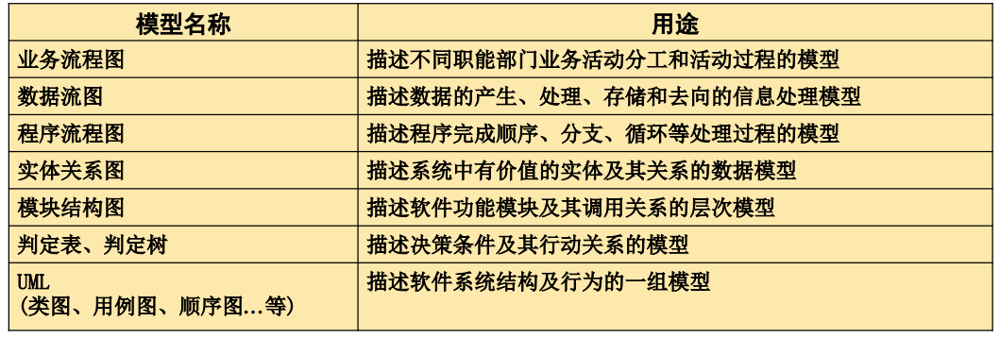


### 3.3

**理解如何建立管理模型**

信息系统的开发本质是建立管理模型并转化为信息处理模型的过程。建立管理模型是系统分析阶段的任务，在系统设计与实现阶段，相应
的模型转换为技术方案。

管理模型描述组织的状况，包括：

- 组织的静态特征，如组织结构图、实体关系图

- 动态特征，如任务分解图、状态转换图、甘特图、PERT图 – 业务流程，如流程图

- 业务规则，如决策树、决策表


管理模型：P53

- 静态建模：E-R模型

- 动态建模：状态迁移、消息传递、对象生命周期、序列与协作Jackson system development, JSD的三个基本构件：顺序、选择、重复

- 过程建模：企业过程有输入输出；企业过程可能跨越组织边界；企业过程有层次性

- 商务规则：反映企业运作中的特定要求、必须遵循的约束和条件。


### 3.4

**掌握 UML 的全称、UML 的视图和图的分类和基本用途**

统一建模语言UML（unified modeling language）是由单一元模型支持的一组图示法。这些图示法有助于表达与设计软件系统，特别是采用面向对象方法构造的软件系统。

UML通过不同的图来描述系统的结构（structure）、行为（behavior）、交互过程（interaction）。

UML 2.2中一共定义了14种图（diagram）：

- 系统结构：类图、对象图、包图、构件图、部署图等
- 系统行为：活动图、状态图、用例图
- 交互过程：通信图、顺序图、计时图等


### 3.5

**理解信息系统的生命周期和主要步骤**

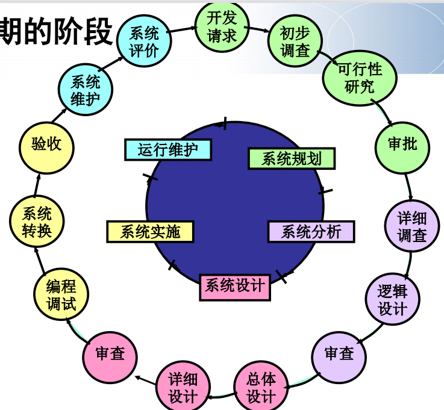

信息系统的研制可以分为５个阶段。

- 系统规划

确定信息系统的发展规划；企业业务流程的识别、改革与创新；对建设新系统的需求作出初步研究，确定信息系统的总体结构；确定系统的备选方案，对这些方案进行可行性分析

提供：可行性分析报告；系统设计任务书

- 系统分析

详细调查，确定系统的基本目标和逻辑功能要求

提供：系统分析说明书

- 系统设计

根据系统说明书中规定的功能要求，考虑实际条件，具体设计实现逻辑模型的技术方案

提供：系统设计说明书

- 系统实施

计算机等设备的购置、安装和调试；编写、调试和测试程序；人员培训；数据准备或转换；系统调试与转换

提供：实施进度报告；系统测试分析报告

- 系统维护

运行情况的记录；必要的修改；评价和总结等

提供系统运行维护记录


### 3.6

**理解基于生命周期的各种开发方法，各自优缺点**

基于生命周期的开发方法有瀑布开发方法、原型开发方法、迭代开发方法、螺旋开发方法、敏捷开发方法共 5 种。

（1）瀑布卡发方法：适用于一些需求已明确并且变化较少的信息系统

（2）原型开发方法：应用于以下场合：需求含糊，用户不能标识出详细的输入、处理和输出。需求设计方案不明确，开发人员不能确定算法的有效性、操作系统的适应性或人机交互的有效性

（3）迭代开发方法：迭代方式又分为增量迭代和进化迭代。

（4）螺旋开发方法：在技术难度较大、内容较复杂的项目中适用于螺旋迭代方法。适用于：单位内部开发的大规模软件项目、风险是项目的主要制约因素、可能会发生重大变更、采用新技术

（5）敏捷开发方法：它是一个比较通用的软件开发方法。


### 3.7

**理解基于软件技术的开发方法**

基于软件技术的开发方法：

- 结构化开发方法
- 面向数据开发方法
- 面向对象开发方法
- 面向服务开发方法


### 3.8

**掌握结构化开发方法与面向对象开发方法的比较 *** 

（1）结构化方法：容易理解和交流，对于大系统可以从全局逐步展开到局部，整体性较好。结构化方法是其他系统开发方法（如面向对象方法）的基础

（2）面向对象：稳定可靠，有利于维护和重用，并容易实现多层分布式结构，但对前期分析设计人员要求较高，用户理解模型有困难。


### 3.9

**了解诺兰模型**

诺兰模型，即信息系统进化的阶段模型。 诺兰认为，任何组织由手工信息系统向以计算机为基础的信息系统发展时，都存在着一条客观的发展道路和规律。数据处理的发展涉及到技术的进步、应用的拓展、计划和控制策略的变化以及用户的状况四个方面。1979年，诺兰将计算机信息系统的发展道路划分为六个阶段。诺兰强调，任何组织在实现以计算机为基础的信息系统时都必须从一个阶段发展到下一个阶段。

**P68**

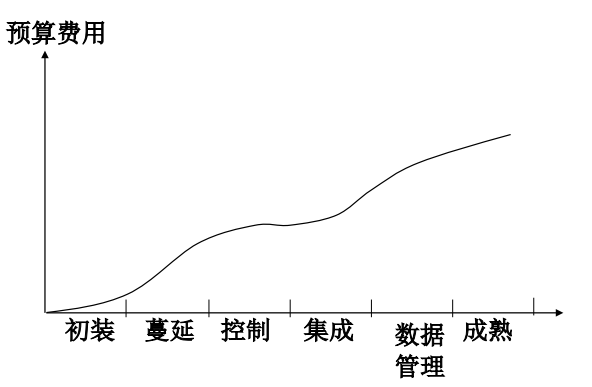


### 3.10

**了解系统开发方式**


信息系统的开发方法从两个维度分类：

开发过程（霍尔三维结构的时间维度）
–信息系统开发过程可以根据特点按照系统工程阶段和步骤有变种，也称为不同的生存周期模型。
–方法将包含整个开发的步骤，每个步骤的任务，由什么人完成，任务的成果如何体现等内容。


开发技术及模型（知识维度和逻辑维度）
–不同的建模方法，从不同的观点来反映系统的全貌，运用学科知识和技术手段予以实现（主要是由信息技术推动的方法论体系）。


## 作业

### 3.2.1

> 对信息系统建模的目的是什么？你认为应该为哪方面建模？

- 对复杂问题进行简化描述，帮助有关人员快速、简单直观、准确地了解系统；
- 建模的过程使得分析师和设计师能更全面地研究系统，深思熟虑，减少遗漏，以形成更成熟的方案；
- 各阶段产生的模型为后续阶段的有关人员提供了工作依据；
- 为项目各类人员提供了统一的交流工具，利于沟通和团队合作；
- 为项目验收和将来的维护工作提供了文档依据；
- 利用工具将模型映射为特定平台的可执行代码（MDD，Model-Driven Development），减少开发人员工作量。

信息系统的分析与设计过程都需要建模。信息系统分析阶段建立系统逻辑模型，设计完成阶受物理模型；信息系统战略规划建立系统概念模型。


### 3.2.2

> 信息系统的研制可以分为哪几个阶段？各阶段的基本任务是什么？各阶段应该题目什么技术文档？

信息系统的研制可以分为５个阶段。

- 系统规划

确定信息系统的发展规划；企业业务流程的识别、改革与创新；对建设新系统的需求作出初步研究，确定信息系统的总体结构；确定系统的备选方案，对这些方案进行可行性分析

提供：可行性分析报告；系统设计任务书

- 系统分析

详细调查，确定系统的基本目标和逻辑功能要求

提供：系统分析说明书

- 系统设计

根据系统说明书中规定的功能要求，考虑实际条件，具体设计实现逻辑模型的技术方案

提供：系统设计说明书

- 系统实施

计算机等设备的购置、安装和调试；编写、调试和测试程序；人员培训；数据准备或转换；系统调试与转换

提供：实施进度报告；系统测试分析报告

- 系统维护

运行情况的记录；必要的修改；评价和总结等

提供系统运行维护记录


### 3.3

> 为什么说系统分析是研制信息系统最重要的阶段？这个阶段的工作困难在什么地方？系统分析员的主要职责是什么？

（１）重要性：
系统分析要回答新系统“做什么”这个关键性问题。只有明确了问题，才有可能解决问题。否则，方向不明，无的放矢，费力不讨好。

（２）团难：
系统分析的团难主要来自三个方面：对问题空间的理解，人与人之间的沟通；环境不断变化。

（３）职责：
在总体规划的基础上，与户密切配合，用统的思想和方法，对企业进行全面的调查分析，分析出现行统的不足，确定新系统的逻辑功能，找出几种可行的解决方案。


### 3.5

> 基于生命周期的开发方法有几种？各自适应于什么类型的项目？

基于生命周期的开发方法有瀑布开发方法、原型开发方法、迭代开发方法、螺旋开发方法、敏捷开发方法共 5 种。

（1）瀑布卡发方法：适用于一些需求已明确并且变化较少的信息系统

（2）原型开发方法：应用于以下场合：需求含糊，用户不能标识出详细的输入、处理和输出。需求设计方案不明确，开发人员不能确定算法的有效性、操作系统的适应性或人机交互的有效性

（3）迭代开发方法：迭代方式又分为增量迭代和进化迭代。

（4）螺旋开发方法：在技术难度较大、内容较复杂的项目中适用于螺旋迭代方法。适用于：单位内部开发的大规模软件项目、风险是项目的主要制约因素、可能会发生重大变更、采用新技术

（5）敏捷开发方法：它是一个比较通用的软件开发方法。


### 3.7

> 面向对象程序设计和结构化程序设计有什么联系和区别？

（1）结构化方法：容易理解和交流，对于大系统可以从全局逐步展开到局部，整体性较好。结构化方法是其他系统开发方法（如面向对象方法）的基础

（2）面向对象：稳定可靠，有利于维护和重用，并容易实现多层分布式结构，但对前期分析设计人员要求较高，用户理解模型有困难。


### 3.8

> 什么是面向服务的体系结构？

面向服务的体系结构（Service-Oriented Architecture，SOA）以服务为软件组成要素，服务对外定义良好的接口和契约，独立于实现服务的硬件平台、操作系统和编程语言。

从概念上讲，SOA中有三个主要的抽象级别元素：

- 操作：代表单个逻辑工作单元的事务。执行操作通常完成数据的存取和加工。与类的一个方法类似。

- 服务：代表操作的逻辑分组。例如，如果我们将客户信用视为服务，则按照客户名称获得客户信用数据、建立信用记录、更新客户信用等就代表相关的操作。

- 业务流程：为实现特定业务目标而执行的一组长期运行的动作或活动。例如：批准一项贷款、本科生转专业、完成订单等。业务流程包括依据一组业务规则按照有序序列执行的一系列操作。操作的排序、选择和执行称为服务或流程编排。


# 4. 系统规划

## 提纲

### 4.1 

**掌握系统规划的任务和系统规划的特点 *** 

系统规划的任务：

（1）制定信息系统的发展战略

（2）确定系统开发的总体方案，安排项目开发计划

（3）制定信息系统建设的资源分配计划

（4）预测未来发展，提供系统今后的发展、研究方向和准则。

系统规划的特点：

（1）面向全局、长远，不确定性，结构化程度低

（2）面向高层管理人员

（3）不宜过细，着眼于子系统划分及相互关系

（4）应与企业规划同步


### 4.2

**理解系统规划的技术和方法，掌握企业系统规划法和 U/C 矩阵构造**

- 企业系统规划法：

共4个步骤

（1）定义管理目标  			

需要调查了解企业的目标和为了达到这个
目标所采取的经营方利以实现日标的约条件能组

（2）定义管理功能组 		

识别企业在管讯过程中的主要活动

（3）定义数据分类 
		

把系统中密切相关的信息归成一类数据，
查明数据共享的关系，建立数据类功能矩阵


（4）定义信息结构		 

定义信息统子系统及其相互之间的数据交换。


- U/C 矩阵构造

矩阵表示了功和数据之间的关系：U：Use、C：Create   橙色框为子系统

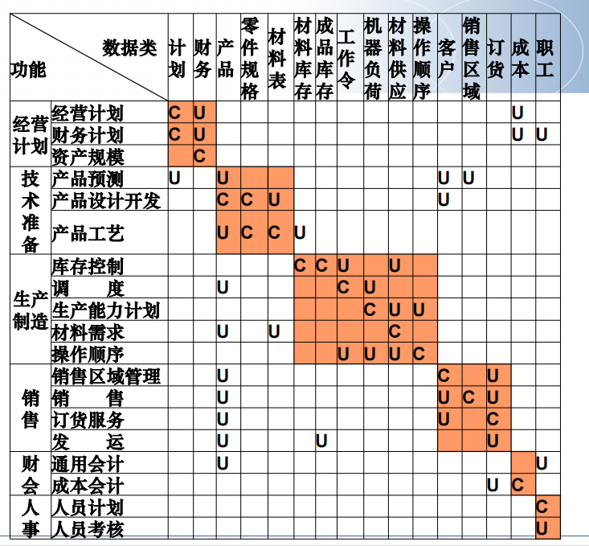


### 4.3

**根据表 4.11 理解系统规划的四个主要步骤**

课本P91

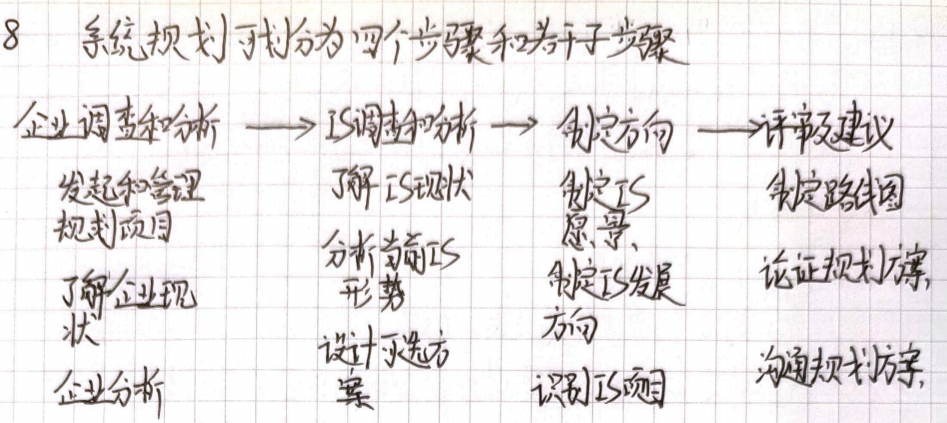


### 4.4

**了解可行性论证的目的、可行分析论证的 3 个方面**

可行性研究是指在项目正式开发之前，先投入一定的精力，通过一套准则，从经济、技术、社会等方面对项目的必要性、可能性、合理性，以及项目所面临的重大风险进行分析和评价，得出项目是否可行的结论。是指在企业当前情况下，研制这个信息系统是否有必要，是否具备必要的条件。

可行性分析的内容：技术可行性、经济可行性、社会可行性。


## 作业

### 4.1

> 为什么要进行管理信息系统结构总体规划？总体规划的任务是什么？

科学的规划可以减少盲目性，使系统有良好的整体性、较高的适应性，建设工作有良好的阶段性，以缩短系统开发周期，节约开发费用。规划是指全面的长远发展计划。信息系统的系统规划又称为信息系统的战略计划，是信息系统生命周期的第一阶段，是对组织总的信息系统目标、战略、信息系统资源和开发工作的一种综合性计划，属于组织对信息系统最高层次管理的范畴，是一个组织的战略规划的重要组成部分，是关于信息系统长远发展的规划，是信息系统的概念形成期。


系统规划的任务：

（1）制定信息系统的发展战略

（2）确定系统开发的总体方案，安排项目开发计划

（3）制定信息系统建设的资源分配计划

（4）预测未来发展，提供系统今后的发展、研究方向和准则。


### 4.4

>  试述 BPS（BSP business system planning企业系统规划法） 法的 4 个基本步骤？

（1）定义管理目标  			

需要调查了解企业的目标和为了达到这个
目标所采取的经营方利以实现日标的约条件能组

（2）定义管理功能组 		

识别企业在管讯过程中的主要活动

（3）定义数据分类 
		

把系统中密切相关的信息归成一类数据，
查明数据共享的关系，建立数据类功能矩阵


（4）定义信息结构		 

定义信息统子系统及其相互之间的数据交换。


### 4.7

> 什么是 IT 治理？为什么要进行 IT 治理？

IT 治理是指设计并实施信息化过程中各方利益最大化的制度安排，包括业务与信息化战略融合的机制，权责对等的责任担当框架和问责机制，资源配置的决策机制，组织保障机制，核心信息技术能力发展机制，绩效管理机制以及覆盖信息化全生命周期的风险管控机制。

该制度安排的目的是实现组织的业务战略，促进管理创新，合理管控信息化过程的风险，建立信息化可持续发展的长效机制，最终实现信息技术的商业价值。


### 4.8

> 系统规划的一般步骤是什么？

（1）环境准备

（2）企业调查和分析

（3）信息系统调查和分析

（4）制定方向

（5）评审及方案建议


### 4.9

> 可行性的含义是什么？信息系统可行性分析包括哪些内容？

“可行性”是指在企业当前情况下，研制这个信息系统是否有必要，是否具备必要的条件。

可行性分析的内容：技术可行性、经济可行性、社会可行性。


# 5. 系统分析概述

## 提纲

### 5.1

**理解系统分析全过程：图 5.1 *** 

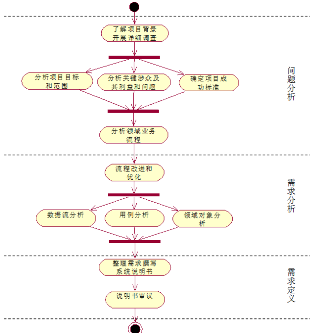

### 5.2

**了解问题分析的步骤**

- 明确项目的背景
- 明确项目目标、范围、相关部门和人员
- 找出关键涉众（stakeholder，也称利益相关人员）及待解决的问题。
- 涉众包括系统的用户、项目决策者、受项目影响的第三方等。
- 调查和分析业务流程，建立业务流程模型以描述用户处理业务的过程及过程中数据的流转。


### 5.3

**了解需求引导方法**

一般用户在开发之初，对所要开发的信息系统应该具有的功能和所能达到的结果并==没有清楚的认识==，因此，需求调查比现行组织系统调查难度更大。对用户进行引导和启发，让用户获得信息系统的感性认识，引导他们发现现行组织管理和业务处理中所存在的问题，从而发掘需求和找到解决方案。

采用以下需求引导方法：

- 原型法：利用快速开发工具，根据用户的初步需求，构造出信息系统的初步原型。

- 联合应用开发（JAD）会议：是一种类似于头脑风暴的技术，在一个或多个工作会议中将所有利益相关者带到一起，集中讨论和解决最重要的问题。

- 观摩法：在系统开发之初，可以让用户参观同行业或同类型成功的信息系统。用户看到这些具体系统，将会对信息系统的功能、作用、外在效果、人机交互方式等产生直观印象，这样就会引导和启发用户，通过类比思维，提出自己信息系统的需求。可采用研究类似产品或解决方案来替代观摩。


### 5.4

**了解需求有两种类型：功能性（业务性）需求和非功能性（技术性）需求**

- 功能性需求：包括系统的软件功能需求和数据需求

涉及商业应用，是系统必须完成的活动或过程，即系统功能以及相关数据。

功能性需求是根据业务过程和业务规则确定的，有些容易获取，有些则是隐含的，需要去发现。 

- 非功能性（技术性）需求：

技术性需求也称非功能性需求，是和公司的环境、硬件和软件有关的所有质量目标，包括响应时间、安全性、可靠性等。

例如：系统必须能支持100个并发用户；保存订单的时间不能超过0.5秒等等，涉及系统性能、可靠性、安全性等质量特性。

通常是一些技术目标。（偏指标）


### 5.5

**了解系统说明书的三方面内容**

引言：项目名称、目标、背景、引用资料、术语说明等

项目描述：项目的主要工作内容、现行系统的调查情况、功能需求、数据需求、其他需求

实施计划：工作任务的分解、进度、预算


## 作业

### 5.3

> 对现有系统的问题分析包括哪些内容？

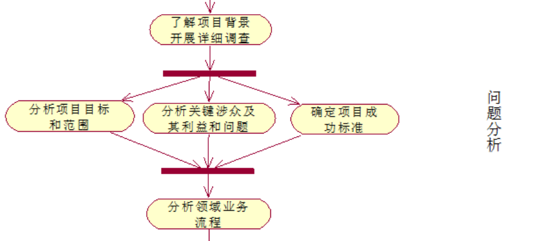

- 明确项目的背景

- 明确项目目标、范围、相关部门和人员

- 找出关键涉众（stakeholder，也称利益相关人员）及待解决的问题。

- 涉众包括系统的用户、项目决策者、受项目影响的第三方等。

- 调查和分析业务流程，建立业务流程模型以描述用户处理业务的过程及过程中数据的流转。

  

问题分析：通过详细调查全面深入理解用户的业务，找出用户所问题分析：
面临的问题准确把握用户的真正的需要，为最终整理出符合用户需要的需求做准备。
需求分析：
分析员与用户充分交流，确完地获联取系统需求。
系统需求包括动能性需求和非功能性需求
该阶段整理并建立最终的需求模型，详细定义和档需求定义。
述每项需求，确认约束条件限制，编写需求规格说明。



### 5.4

> 请对高校学籍管理系统进行涉众分析。

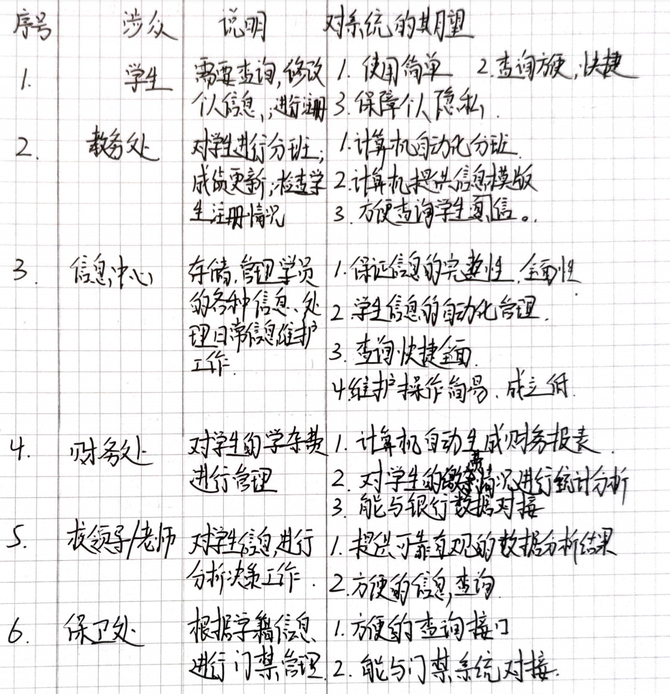


### 5.5

> 系统说明书包括那些内容？

引言：项目名称、目标、背景、引用资料、术语说明等

项目描述：项目的主要工作内容、现行系统的调查情况、功能需求、数据需求、其他需求

实施计划：工作任务的分解、进度、预算


# 6. 流程建模

## 提纲

### 6.1

**掌握绘制业务流程图 *** 


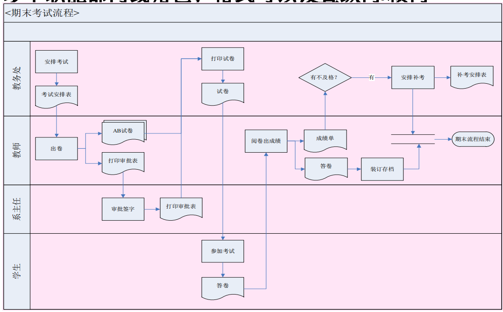


### 6.2

**理解 BPR 和 BPM 概念**

- BPR （business process reengineering） 企业过程重组

原有流程中的大部分工作是没有给客户带来价值的，而这部分工作要被去除，而并不只是简单利用IT技术来提速的。

关注业务流程优化和变革，疾风骤雨

- BPM（business process management）业务流程管理

对企业的业务流程做一个全面梳理，明确哪些流程对企业很重要，哪些流程对企业不太重要，对所有流程进行分析、设计、描述和维护管理，并通过IT 技术和工具对流程自动化进行支持。
关注业务流程管理和持续完善，和风细雨
BPM中包含BPR的内容


### 6.3

**掌握绘制数据流图（数据流的注意事项、层次划分 3 点标准、正确性检查 4 点、易理解性 3 方面）*** 

例子：

学校对毕业设计的前期工作规定如下：
-第7学期末，教务秘书要求每个教师按照职称上报指定数量的毕设题目；
–教师提交初始题目；
–教务秘书审核后公布题目清单；
–学生可以根据题目选择指导教师；
–教务秘书收集所有学生的选择志愿，并根据学生综合测评成绩进行分配，使每个学生有一个指导教师；
–教师得到分配的学生后，与学生讨论后确定题目，于第8学期始填写任务书，交给教务秘书和学生；
–教务秘书整理所有学生毕设信息，填报毕设一览10 表，上报教务处。

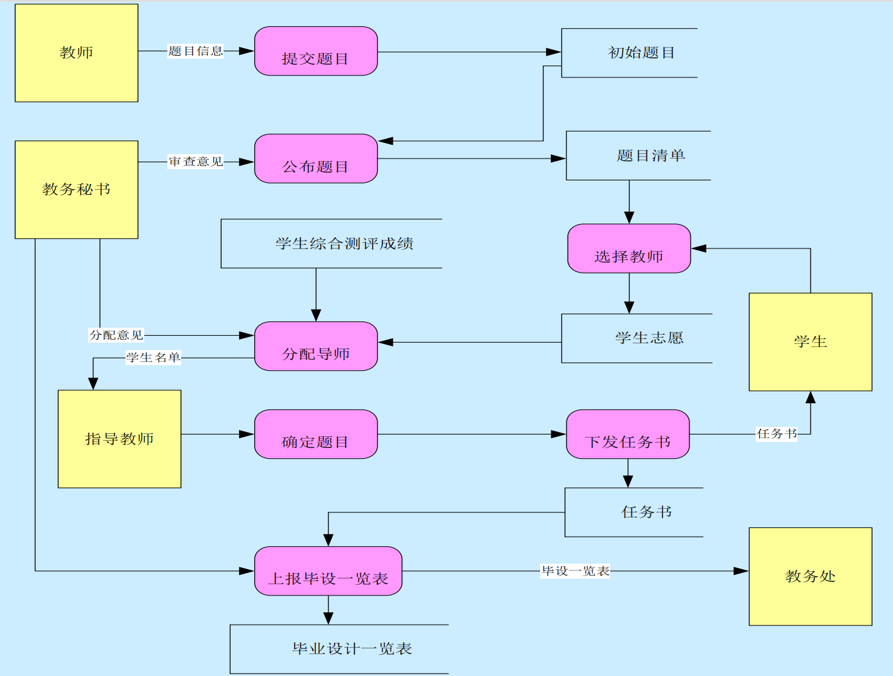


要注意以下几点：

1. 关于层次的划分

   一个处理框经过展开，一般以分解为4～10处理框为宜（最好5-9个）（2个的明显是不规范）

   展开的层次与管理层次一致，也可以划分得更细。同一张图上的所有处理过程应该处于同一个抽象层次上（抽象粒度一致）

   最下层的处理过程用几句话，或者用几张判定表，或一张简单的HIPO图能表达清楚

2. 语法的正确性

   语法1：数据守恒，或称为输入数据与输出数据匹配

   语法2：在一套完整的数据流图中的任何一个数据存储，必定有流入的数据流和流出的数据流。

   语法3：父图中某一处理框的输入、输出数据流必须出现在相应的子图中。

   语法4：任何一个数据流至少有一端是处理框

3. 可读性

   - 利用数据存储简化处理间的联系

     例如：P2成绩管理->P1异动管理之间的联系可以通过D3留退名单简化，即“P2成绩管理”产生“D3留退名单”，“P1异动管理”根据“D3留退名单”完成学籍变动

   - 每层的处理框均匀分解，应齐头并进

   - 所有元素适当命名

4. 确定系统边界


### 6.4

**掌握数据字典各类条目的绘制 *** 

数据字典是对DFD的补充描述，用来描述数据流程图中的数据流、数据存储、处理过程和外部实体的详细内容。

数据字典中有六类条目：

- 可被重用的条目：

1. 数据元素

2. 数据结构

- DFD图中的元素：

3.  数据流（可引用定义好的数据结构）

4. 数据存储（可引用定义好的数据结构）

5. 外部实体

6. 处理

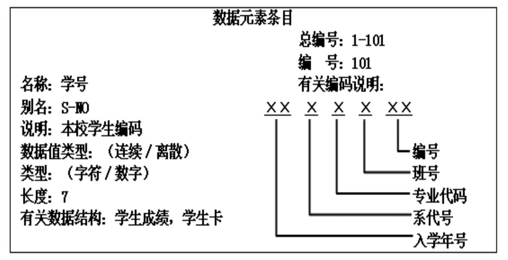


见课本125页


### 6.5

**掌握画判定树和判定表画法及其转化 *** 

- 结构化语言

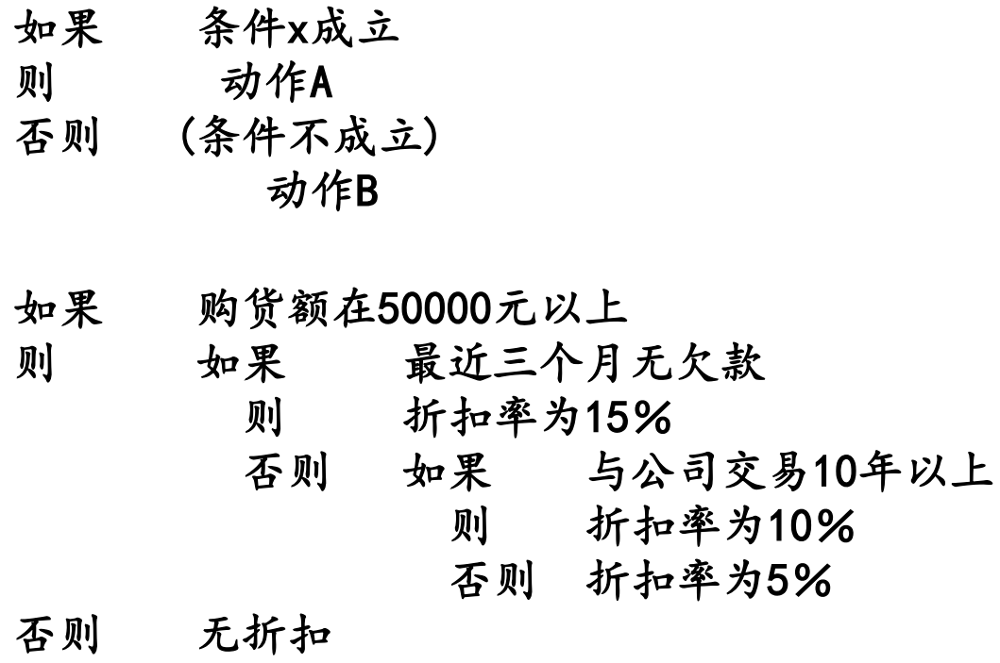

- 判定树

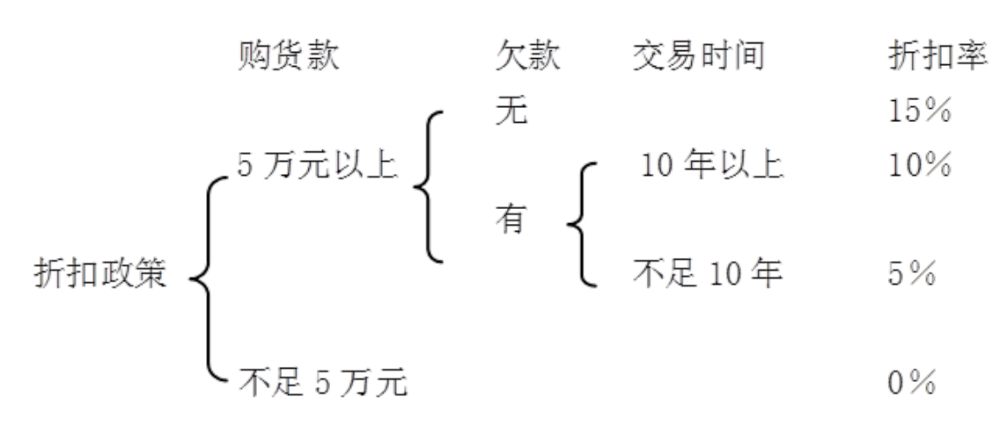

  

- 判定表

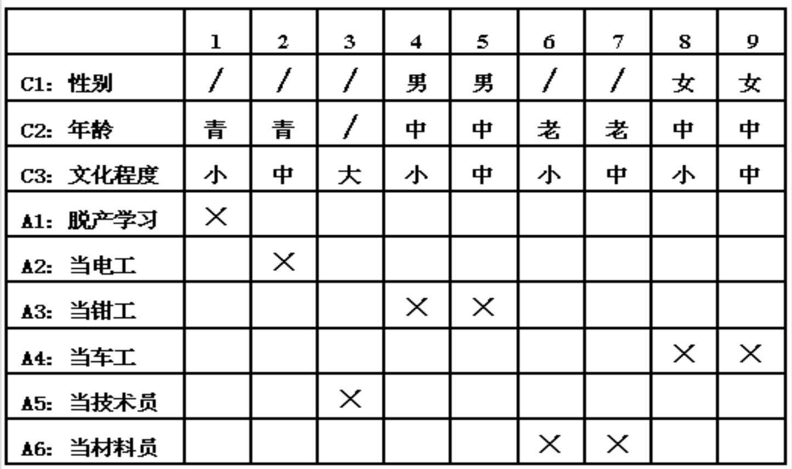


### 6.6

**理解判定表的合并**

合并的原则：

取相同行动的ｎ列，若有某个条件C~i~ 在此n 列的取值正好是该条件取值的全集，而其它条件在此ｎ列都取相同的值，则此ｎ列可以合并。


# 7. 用例建模

## 提纲

### 7.1

**了解用例的概念**

用例分析是站在最终用户的角度看待系统及其特性，模型简单直接，一经提出便受到软件开发人员的青睐。

用例总是和面向对象方法放在一起讨论，并且在面向对象标准建模语言UML中用例也具有中心地位。但严格意义上讲，用例并不是一个面向对象方法论的产物，不包含面向对象思想，只是因为用例概念最初是和面向对象方法一同提出并得到广泛接受而已


基于用例的需求分析基本步骤：

\- 从系统涉众获取候选需求

\- 结合系统业务背景理解候选需求

\- 捕获信息系统功能性需求（用例模型）

\- 捕获与功能需求相关的非功能性需求或其他技术性要求


### 7.2

**掌握用 UML 绘制用例图 ***

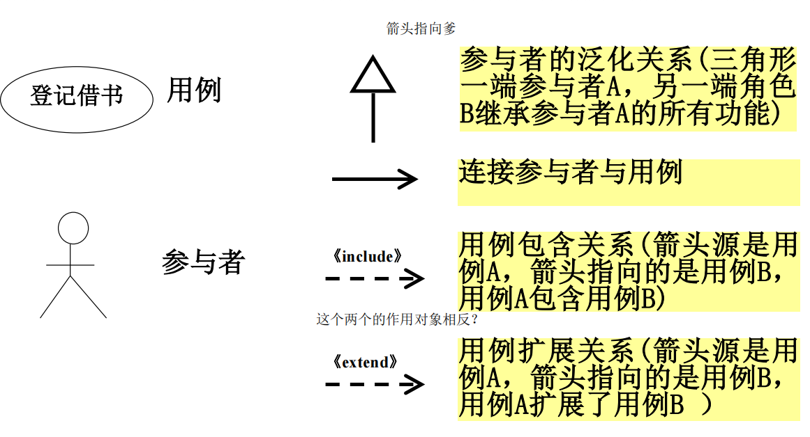

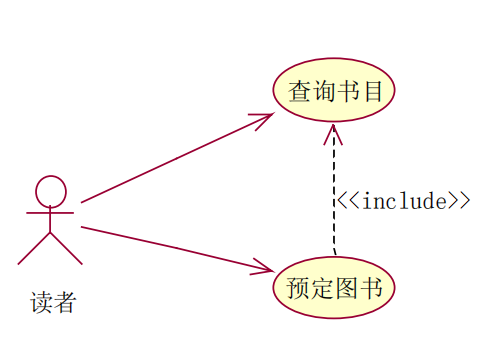


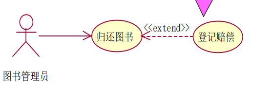


### 7.3

**掌握用例的描述，规格说明的主要内容，并能够用用例规格说明（模板）描述用例*** 

用例规格说明Use Case Specification 的模板：

用例名称

主要参与者/次要参与者

简要描述

前置条件

后置条件

主事件流（主要成功场景/基本路径）

备选事件流（扩展路径/替代流程/异常事件流）

特殊要求/非功能性需求

发生频率

- 例

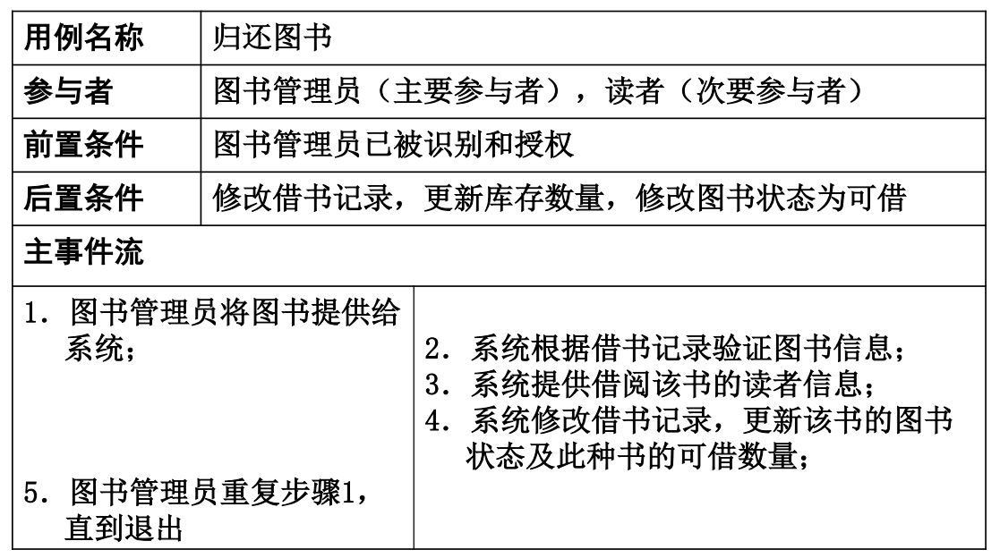


### 7.4

 **掌握用例之间的关系（包含、扩展、泛化）***

见课本P148

- 包含

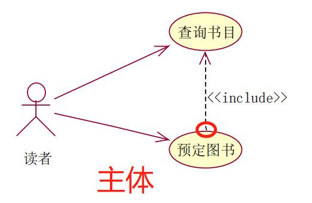

- 扩展

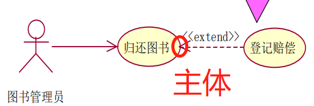

- 泛化

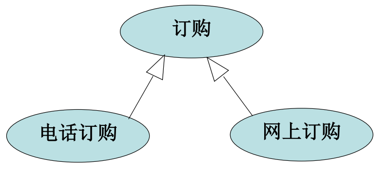


# 8. 领域对象建模

## 提纲

### 8.1

**了解面向对象方法基本概念**

从面向对象的角度来看，世界就是由对象组成的。

- 任何给定的商业功能都是由一整套共同工作的对象互相协作来完成的。
- 对象不仅可以执行功能，还拥有属性（数据）。
- 计算机世界更好地映射现实世界。


- OOP

\- 面向对象的程序设计语言Simula、SmallTalk

\- C++、VB

\- Java

- OOD

\- 面向对象的软件结构设计

- OOA

\- 寻找问题领域的对象或事物


### 8.2

**掌握接口、封装、继承和多态概念 ，覆盖和重载的区别*** 

- 接口

接口（interface）是抽象类的变体。接口是一些方法的集合，但所有方法都是抽象的，只有声明而没有程序体。其它类需要实现某个接口时才对这个接口的所有方法进行定义。

接口举例：

定义一个几何计算的接口，用于计算容器的表面积和容积。

```c++
interface Math
{
    public void CalcArea();
    public void CalcVolumn();
}
//长方形箱子
class Box implements Math
{
    private float lenght,width,height;
    public void CalcVolumn()
    {
    ……
    } 
}
//圆柱桶
class Tub implements Math
{
    private float radius,height;
    public void CalcVolumn
    {
    ……
    } 
}

```


- 封装

封装即信息隐藏，它保证软件部件具有较好的模块性。
设计软件总体结构时，应尽量封装为独立的模块，每个模块对外提供接口，而尽可能少地显露其内部处理逻辑。（黑箱）
**对象**是更高一个级别的封装体，它把数据和服务封装于一个内在的整体。对象向外提供某种界面（接口），可能包括一组数据（属性）和一组操作（服务），而把内部的实现细节（如函数体）隐蔽起来


- 继承	

继承是指特殊类的对象拥有其一般类的全部属性与服务。抽取很多不同类型对象的共同点形成一般类，这个过程称为泛化（generalization）。

一般类/特殊类、父类/子类、超类/子类、基类/派生类等都是相同的概念。可以简化系统的描述和实现，较好地实
现软件重用，提高效率。

子类（特殊类）可以继承父类（一般类）的属性和操作，也可以重新定义特殊行为。

继承可分为单继承和多继承，单继承是指子类只从一个父类继承，多继承是指子类从多个父类继承。

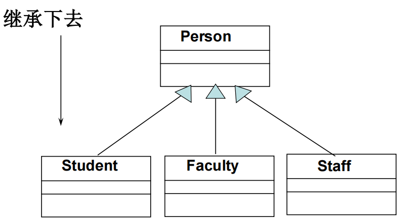


- 多态

多态性又叫多形性，指相同的操作（或函数，或过程）可作用于多种类型的对象并获得不同的结果。
在OOP中多态的实现有两种方法：

- 由**覆盖**（override）实现动态多态，子类对父类的方法进行重写，称为运行时多态，展示的是父类及其多个不同子类的多态性。
- 由**重载**（overload）实现的静态多态，即利用重载技术在一个类中定义多个名称相同、参数类型不同的方法，称为编译时多态，是一个类中操作多态性的表现。


### 8.3

**理解类之间和对象之间的关系**

领域对象就是**问题域**中有意义的**概念类**，它们是现实系统中的事物（things）或事件（events）。
软件系统中的类一部分来自于领域对象


### 8.4

**理对象的关联，整体部分关联，和通用关联分类**

- **关联**表示不同类的对象之间的静态关系，它在一段时间内将多个类的实例连接在一起。可以使用关联表示对象了解其他对象的程度。

关联的要素：

1. 关联名称

2. 对象在关联中的角色

   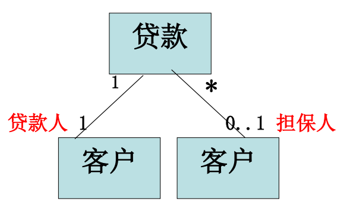

3. 多重性（数量）

   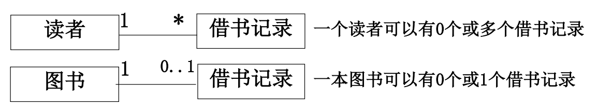

4. 导向性（箭头）

   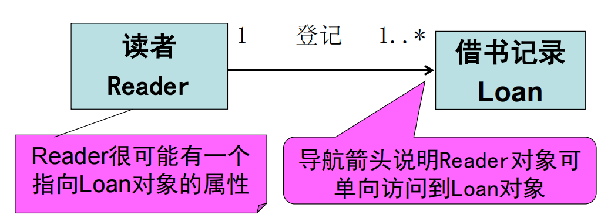

- **整体部分关联**

如果对象a是对象b的一个**组成部分**，则称b为a的整体对象，a为b的部分对象，二者对应的关联形式称为整体-部分关联

整体-部分关联有两种类型：

- 组合聚集(composition aggregation ) 

  组合聚集具有很强的归属关系，在特定时刻部分只能是一个组合对象的成员。
  整体端的重数不会超过 1（即它无法被多个整体对象共享）,关系建立后一般不可变更。

  公司-----员工

  产品---零件

  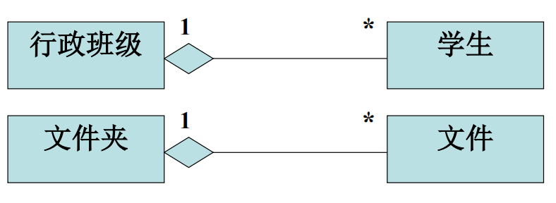

- 共享聚集 (shared aggregation)

  描述整体-部分的关系，部分可能同时属于多个整体对象。
  关联路径的末端有一个空心菱形，用来表示聚集关系。

  视频平台会员----用户

  俱乐部成员------客人

  

  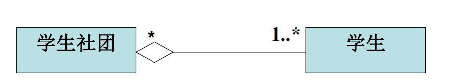


- **通用关联分类**

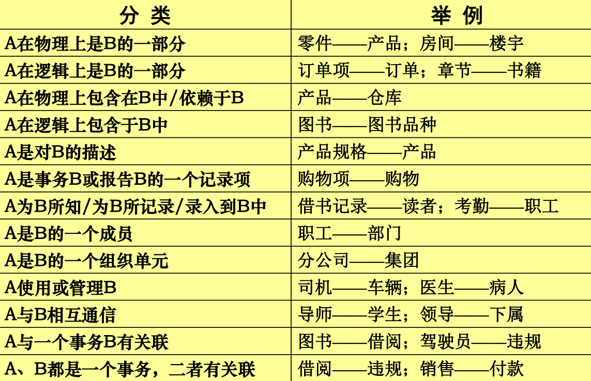


### 8.5

**理解泛化关系**

泛化（Generalization）是在多个概念之间识别共性，定义超类（一般概念）和子类（特定概念）关系的活动。

注错误用法：

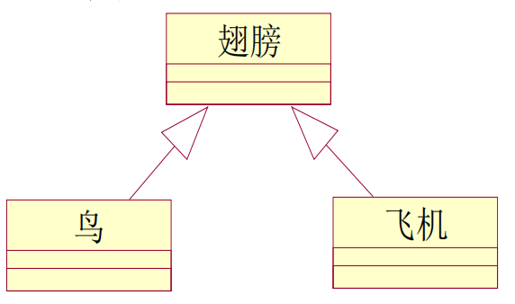

不符合”is a kind of”且采用组装结构，将复用对象作为组成元素，滥用了泛化，应该将翅膀变为组件来使用。


### 8.6

**掌握使用 UML 图画领域对象、类图、对象的关联、泛化关系等 ***

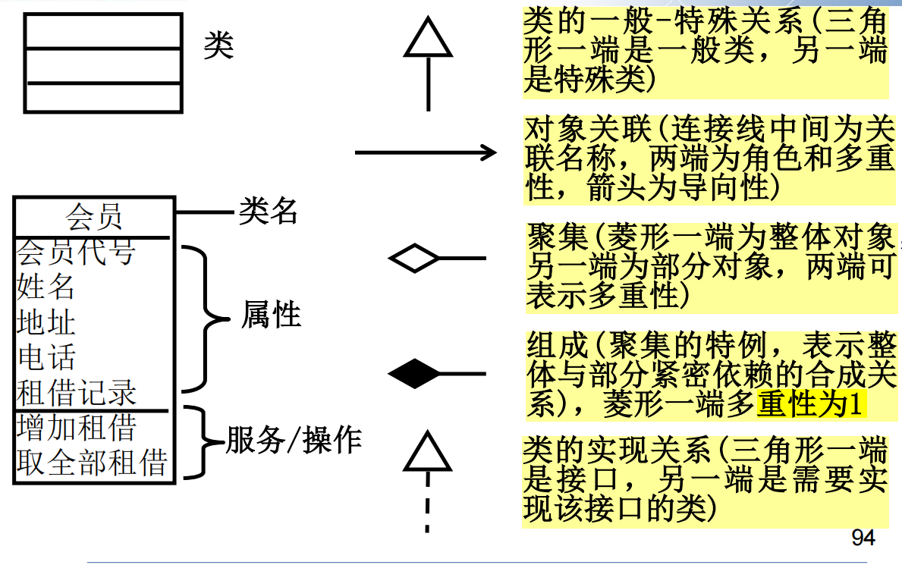


## 作业

### 8.2

> 解释继承、封装、消息和多态性的概念。它们分别带来什么好处？

**继承**：是指特殊类的对象拥有其一般类的全部属性与服务。特殊类在继承一个一般类的语义性质外，还有自己特有的属性和操作。

好处：

1. 简化系统的描述和实现

2. 直接实现了软件的重用，提高软件开发效率


**封装**：即信息隐藏，封装使对象对外仅提供接口，即可见的一些属性和操作(public) ，而具体实现不可见。它保证软件部件具有较好的模块性。

好处：

1. 使用者只关注界面/接口，无需了解内部机制，简单易用；

2. 只要对象接口不变，对象内部逻辑的修改不会影响其它部件，便于复用，也减少了因修改引起的“水波效应”； 

3. 严密的接口保护，使对象的属性或服务不会随意地被使用，对象的状况易于控制，可靠性随之增强；

4. 开发人员一旦设计好对象的界面（接口）后，不需要等待该对象全部完成就可以进行后续开发，实现并行工作。


**消息**：消息是指向对象发出的服务请求(对象间的交互信息)。对象通过对外提供的服务在系统中发挥作用。当需要请求对象执行某种服务时，就需要向该对象发送消息。

好处：

1. 更接近人们日常思维所采用的术语，符合对象的独立自治原则

2. 在分布式环境中，对象可以在不同的网络结点上相互提供服务，消息具有更强的适应性。


多态性：多态性又叫多形性，指相同的操作（或函数，或过程）可作用于多种类型的对象并获得不同的结果。多态性一般需要建立在继承机制之上。

好处：

1. 当给不同子类型的对象发送相同的消息时，消息的发送者可以不用关心具体的对象类型，而由对象自身做出不同的响应处理。

2. 需要扩充一种新类型时，只需要从父类中再派生出一个子类，覆盖父类的某些服务，而不需要改动其它外部程序。

3. 多态性极大地提高了重用性和灵活性，对象的使用和理解也得以简化。


### 8.6

> 对象关联如何确定？类图中如何表示对象关联？

关联表示不同类的对象之间的结构关系，它在一段时间内将多个类的实例连接在一起。关联体现的是对象实例之间的关系，而不是表示两个分类之间的关系。	

常使用关联名称、角色、多重性和导向性来说明关联。

对象关联在类图中的表示：	

1.多数关联式二元的，即只存在于两个类的实例之间，在图中表示为连接两个类符号的实线路径。

2.关联路径的两端是角色，角色规定了类在关联中所起的作用。每个关联都必须有名称，而且对应一个类的所有角色名称都必须是唯一的。

3.多重性表明了该类的多少个对象在一段特定的时间内可以与另一个类的一个对象相关联

4.导向性用一个箭头表示，该箭头置于关联连接的目标端，紧靠目标类。


### 8.7

> 泛化关系如何确定？类图中如何表示对象关联？

泛化是在多个概念之间识别共性，定义超类（一般概念）和子类（特定概念）关系的活动。如果类 A 具有类 B 的全部属性和行为，而且具有自己特有的某些属性或服务，则 A 叫做 B 的特殊类，B 叫做 A的一般类。这种关系也称为一般-特殊关系、泛化-特化关系、继承关系。

泛化关联在类图中的使用：

1. 类的一般-特殊关系使用空心三角连接直线表示，三角形一端是一般类，另一端是特殊类。
2. 聚集关系由空心菱形连接直线表示，菱形一端为整体对象，另一端为部分对象，两端可表示多重性。
3. 组成关系由实心菱形连接直线表示，是聚集的特例，表示整体与部分紧密依赖的合成关系，菱形一端多重性为1。

4. 使用抽象概念类如果一个类 A 的每一个成员必须同时是其子类的成员，那么称 A 为抽概念象类。

5. 多继承泛化关系中有多继承和单继承。多继承是指一个子类继承了两个父类的属性和行为。


### 8.9 

> 对于一个餐馆点餐和结账系统，可以识别出哪些概念类？各自有哪些属性？

大致可以识别出3个基本概念类：

1. 菜品

名称
单价
状态


2. 顾客订单

订单编号
桌号
折扣
金额
开单时间
记账人
状态


3. 预定记录

预定编号
姓名
电话
预定时段
预定类型
抵达时间
状态


其中订单包含了菜品，可以将上面3个基本概念类绘制如下：


### 8.11

> 搜集更详细的大学教务管理的有关文档，识别出大学教务管理系统中的概念类，并绘制类图。

大学教务管理系统的参与者主要有学生，老师和教务员

主要的概念类有课程和成绩

类图绘制如下：


# 9.系统设计概述

## 提纲

### 9.1

**理解系统设计的目标 *** 

设计系统之前，先看看评价信息系统的标准，这些标准对任何设计方法都适用：

1. 信息系统的功能：是否满足用户的需求
2. 系统的效率：响应时间、操作的方便性
3. 系统的可靠性：抗干扰能力、故障恢复
4. 系统的工作质量：准确性、使用效果
5. 系统的可变更性：修改和维护的难易程度
6. 系统的经济性：系统收益与支出比


### 9.2

**掌握系统设计的内容 *** 

一般划分为两部分：

- 总体设计
  - 设计软件的体系结构（也称架构，architecture）
  - 设计软件结构，即具体组成元素及其关系（structure） 
  - 设计系统对外接口和服务

- 详细设计

  各项具体细节，涉及软硬件的各个方面


### 9.3

**理解系统设计师的素质要求**

- 创造性设计思维；
- 丰富的编程经验和很强的逻辑思维能力；
- 具备将复杂的问题分解成简单问题的能力，设计易于使用和维护的软件结构，并保证较好的重用性；
- 应对系统结构尤其是软件结构具有较强美感，善于运用巧妙优美的设计模式；
- 应有大局观，懂得平衡各种开发局限的制约，权衡时间、进度成本与系统质量、性能等因素提出最佳方案。


### 9.4

**了解软件结构的演变**

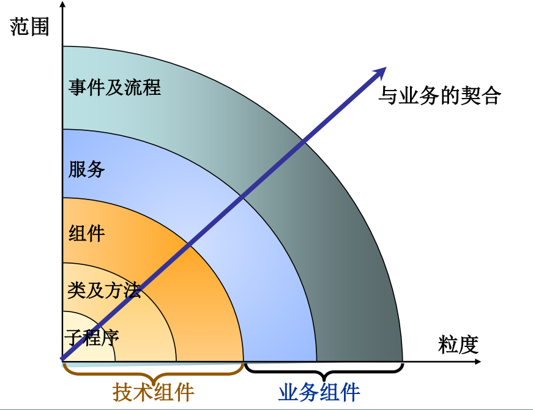


# 10. 系统总体设计

### 10.1

**理解架构、软件架构的概念**

架构包含系统的一组**基本结构**（structure），每种结构都有各种类型的部件（component）及其**关系构成**，架构描述了这些部件的组合、相互调用参照、通信以及其他动态交互。

**软件架构**（software architecture）的定义没有统一的版本，一般认为：一个应用程序或计算系统的软件架构是一个或一组结构，它包含组成系统的软件元素、这些元素对外可见的性质以及它们之间的关系。对外可见的性质指软件元素能够提供的服务、性能特征、错误处理、共享资源的用法等。

软件的一个结构元素可能是一个子系统、构件、进程、库、数据库、计算结点、遗留系统等等。

软件架构是**最高层次的系统分解**，它不会囊括所有的结构和行为的定义，它只关注那些被认为是重要的元素。 

架构难以更改，一旦修改，意味着整个系统重建，而结构修改只影响局部。


### 10.2

**了解多层应用架构设计、三个基本层次、MVC 架构模式 3 个基本部件**


### 10.3

**理解软件框架的概念 *** 


### 10.4
**了解什么是包、包的分类原则**

### 10.5
**了解接口概念**
### 10.6
**掌握模块的概念**
### 10.7
**了解结构图画法**
### 10.8
**掌握模块的耦合方法*** 
### 10.9
**了解模块的内聚方法**


### 10.10
**了解模块的扇入和扇出含义**


### 10.11
**了解不同类的职责分配**


### 10.12
**掌握面向对象设计方法，UML 绘制类图和顺序图，包括类的属性和方法，消息调用**


### 10.13
**理解类的四种关系设计：泛化（类），关联（对象），实现（类），依赖（对象）**


### 10.14
**了解面向服务设计方法的概念，SOA 概念4**


### 10.15
**了解设计原则、设计模式**


### 10.16
**了解高内聚模式、低耦合模式**


### 10.17
**了解 Gof 模式**
